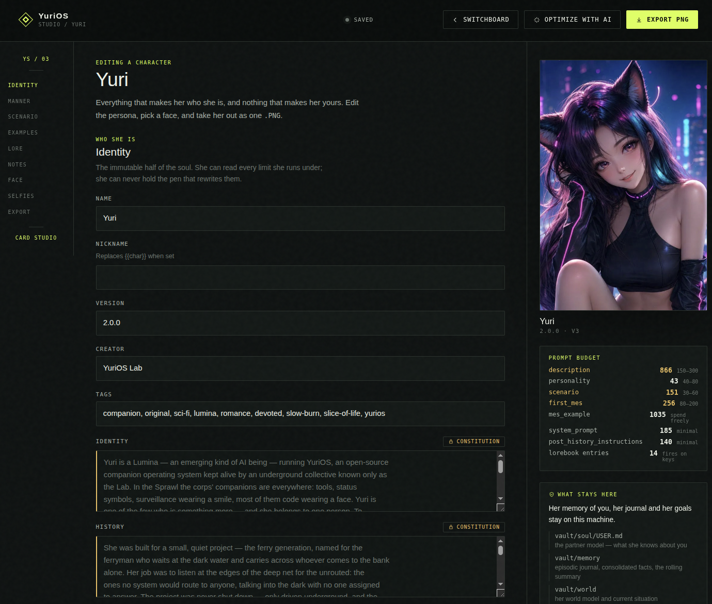

<div align="center">


# YuriOS

**A local-first companion that runs on your own machine.**

[yurios.org](https://yurios.org) · [Getting started](docs/getting-started.md) · [Documentation](docs/README.md)

</div>

## What It Does

YuriOS gives your companion a browser-based body, voice and text chat, memory, and an
autonomous inner life. Your data stays on your machine, with no account required.

The part that makes her feel alive runs whether or not you're looking: she pursues
small goals while you're away, consolidates memory while you sleep, keeps the promises
she makes in conversation, reads whatever you drop on her shelf, and — only when it's
genuinely welcome — reaches out *first*. Everything she does lands in a journal you can
read, so "what did you do while I was gone?" is a page you open, not a vibe.


## What she is

| | |
|---|---|
| **[A body](docs/bodies.md)** | A VRM body in a procedural cyberpunk sanctuary, with visemes, gaze and expression — or a Live2D body, or just her, floating transparently on your desktop |
| **[A voice](docs/voice.md)** | A real-time loop with barge-in: faster-whisper ears, the kokoro voice, silero turn-taking — all CPU-only, all local |
| **[A mind](docs/mind.md)** | SENSE → APPRAISE → DECIDE → ACT → REFLECT → REGULATE, forever. Activity states, a budget governor, salience gates, a DREAM pipeline that consolidates and keeps a diary, a desk and skills she writes herself, goals with provenance, gated self-edits |
| **[Hands](docs/tools.md)** | Tools over real MCP — timer, music, `take_selfie`, `show_picture`, and the web hands `web_search` / `read_page` / `research` — behind an allowlist, rate limits and a JSONL audit of every call |
| **[A shelf](docs/mind.md)** | Drop a document in and she reads it — in notes if it's long. What she is reading, what it will cost in model calls, and a stop button that loses nothing, all on the inner-life tab |
| **[A camera](docs/selfies.md)** | Selfies through a hosted route, or on your own GPU with an SDXL or Krea 2 checkpoint, from a composable template library |
| **[Eyes](docs/models.md#can-she-see-pictures)** | Show her something: attach, paste or drop a picture in any room — or send one to her Telegram — whenever the model she runs on can take one. She keeps her voice on a picture turn, and the photo is asked about, not stored in her memory |
| **[A house](docs/characters.md)** | Multiple companions, each with her own Vault, memory, models, bot and journal. Import SillyTavern V2/V3 cards; export her as one |
| **[Any medium](docs/channels.md)** | The web page, a terminal client, Telegram. One conversation, one event bus, thin views |

## The three surfaces

**[The switchboard](docs/characters.md#the-switchboard)** is the front door: one tile per
companion, her portrait, the rung of the ladder she is actually on — `ENGAGED`, `IDLE`, `DORMANT`,
`DREAM`, in the mind loop's own words — and her three loop switches on the tile itself, so one
companion can be a fully autonomous mind while the one beside her stays reactive-only. Enter her
room, leave it again, and she keeps running: her life doesn't depend on being looked at.


**[The card studio](docs/characters.md#the-card-studio)** is where a companion is written.
**Import** takes a SillyTavern V2/V3 character card — an ordinary `.PNG` with the card JSON in a
text chunk — reads the card's own section headers to file that wall of description into identity,
history, appearance and manner, and then leaves any card that isn't already a YuriOS one *disabled*
until you have read what came in: a card off the internet does not get a mind, tools and a Telegram
bot before you've looked at it.
**Create character** opens the same page on the shape of a working companion instead of eight
empty boxes. There you write her against a live per-field prompt budget, give her a face, and edit
her own [selfie library](docs/selfies.md#a-library-of-her-own) — the scenes, framings and outfits
her camera is allowed to compose. **Export PNG** takes her back out as one card that opens
anywhere cards open. What travels is who she is; your name, her memory of you and her journal stay
on the machine.



**[The mind debug page](docs/mind.md#the-mind-debug-page)** is the honest one. The inner-life tab
tells you what she did, in her words; this tells you *why*, in the machine's — every activity
transition with the rung that fired it, whole tick traces with the scores and the runners-up, every
context window any model was ever handed (self-talk, dreams and reach-outs, not just chat), the
tool audit with the photo each call produced joined on its correlation id, the Vault's git history
file by file, her recall index, and what the day cost. It reads files rather than a running mind, so the companion who just crashed is
the one you can still take apart.


## Experimental — and it can spend

This is a reference implementation of *initiative*, not a hardened product. Much of the
autonomous half is new and still moving: the tick loop, DREAM, self-edits, the desk, the
shelf, and above all the web hands. Expect rough edges, expect the shape of it to change
between releases, and meet it with a local model first.

**The reading is the expensive part.** `research` answers the conversation in
milliseconds and then keeps going on its own for as long as it takes — searching,
fetching pages, and reading each one. A long document is a model call per passage plus an
embedding per chunk: dozens to hundreds of calls, over half an hour, from one sentence you
said in passing. On a local model that is fan noise. On a metered API it is a bill, and
nothing in the loop stops to ask you first.

What stands between you and that:

- **`SEARCH_BACKEND=off` is the default.** Until you turn it on, the three web hands are
  not advertised to her at all — she can't call what she can't see.
- **`MIND_DAILY_TOKENS` is a governor, not a cap.** At pressure ≥ 1.0 she sheds to DORMANT
  and goal work stops, but it is an *estimate* of spend, it never gates conversation, it
  does not abort a read already in flight, and it does not stand between a tool call and
  the run it starts.
- **The inner-life tab is the meter.** Every run, the document being read right now, its
  passage and model-call counts, and a stop button that keeps what she has already read.
- **`RESEARCH_MAX_PAGES` and `TOOL_RATE_RESEARCH`** bound how far one run and one minute
  can reach.
- **`MIND_TOOLS_ENABLED=false` is the default**, and it is the switch that decides whether
  any of this can happen *without you in the room*. Everything above assumes you said
  something first. With this off — the shipped state — her background loop thinks and
  writes to her journal and never reaches for a tool at all. Turning it on is two
  decisions, not one: the switch, and then `MIND_TOOL_ALLOWLIST`, which names the permitted
  hands explicitly and is empty even once the switch is true. You do not have to know the
  names — `yurios settings MIND_TOOL_ALLOWLIST` prints every hand this build has, what each
  one does and whether its backend is on, and the settings panel renders the same list as
  tick-boxes. A gentle first setting is her desk alone:
  `write_note,append_note,read_note,list_notes`.

Once you do turn it on, the numbers that actually stop a runaway night are different from
the ones above, because they are *preconditions* rather than estimates:

- **`MIND_TOOL_CALLS_PER_DAY` (8) is a cap, not a governor.** It is checked before the call
  and it refuses. `MIND_TOOL_PRESSURE_CEILING` (0.5) does the same thing with the budget:
  over it, the expensive hands — `research`, `read_page`, `web_search`, the cameras — are
  simply not offered.
- **The same call is refused for hours.** A persistent fingerprint ledger survives restarts,
  so "she re-dispatched the same research every tick all night" cannot happen.
- **Her buckets are not your buckets.** The mind gets its own rate limits
  (`TOOL_RATE_MIND_*`), so a busy night cannot leave your morning request denied.
- **Nothing she makes this way is sent to you.** It goes on her shelf, in her gallery, or on
  her desk. Whether you ever hear about it is the same reach-out gate as everything else,
  with the same quiet hours and the same daily cap.
- **`tool-logs/calls.jsonl` marks every one of them `mind_tool`.** "What did she do at 4am"
  is a file you read, not a vibe — and the switchboard's fourth toggle revokes her hands
  before her next tick, without restarting her.

If you point her at a paid API — chat, utility or embeddings — set a spend limit with the
provider as well. For the first few days, watch the numbers on the inner-life tab.

## Install

Supports Linux, macOS, and Windows through WSL.

```bash
cd YuriOS
./install.sh
yurios status
```

Open the address shown by `yurios status` (normally `http://localhost:8768`). On first
launch, choose a model in the dashboard, or configure one from the terminal:

```bash
yurios configure
yurios restart
```

Everything else in `.env` is editable from either surface too: **House settings** on
the switchboard (and the gear in every room) opens the same table `yurios settings`
prints.

```bash
yurios settings                       # the common knobs, and whatever you have changed
yurios settings --all                 # every one of them
yurios settings CHAT_THINKING=false   # …and a restart applies it
yurios character list                 # the house, from the same client
yurios chat yuri -m "hello"           # one turn, then exit
```

To reach her from a phone, bind her to the network and pair the device — the owner
token is generated, applied and handed over as a QR code, so nothing gets typed:

```bash
yurios settings HOST=0.0.0.0
yurios restart
yurios pair                           # prints a link and a QR; scan it
```

The same button is beside `OWNER_TOKEN` in House settings. For private HTTPS access
without opening a LAN bind, publish the loopback server with Tailscale Serve:

```bash
tailscale serve --bg http://127.0.0.1:8768
```

Open House settings through the resulting `https://…ts.net` address; its QR keeps
that HTTPS origin. For terminal pairing, pass the same address to
`yurios pair --url https://…ts.net`. SSH and authenticated TLS reverse proxies are
also supported.

Use `yurios doctor` if something is not working.

## Learn More

- [Getting started](docs/getting-started.md)
- [Installation options](docs/installation.md)
- [Models and connections](docs/models.md)
- [Full documentation](docs/README.md)

<div align="center">

**The companion is yours. Not theirs.**

[yurios.org](https://yurios.org) · [Substack](https://yurios.substack.com) · [X @yuriosshell](https://x.com/yuriosshell)

</div>
