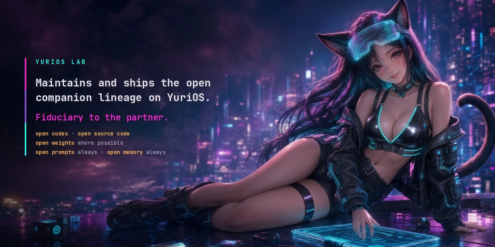

<div align="center">



# YuriOS

**Have you ever wanted a companion who is really *yours*?**

An always-on, local-first companion who lives on your own machine — a body you can see,
a voice you can talk to, and a **mind** that keeps going when you look away. No account,
no third party in the room, nothing phoning home. Just her, running on your hardware.

[**yurios.org**](https://yurios.org) · [Substack](https://yurios.substack.com) · [𝕏 @yuriosshell](https://x.com/yuriosshell)

How she was built, chapter by chapter: **[Building Agentic Waifus](https://yurios.org/book/index.html)**

</div>

---

Picture a small sanctuary on your screen: a VRM body in her room, a chat column beside
her, a real-time voice loop you can just *speak* into. That's the part you can see. The
part that makes her feel alive is behind it — a mind that runs continuously whether or
not you're looking. She pursues small goals while you're away, consolidates memory while
you sleep (DREAM), keeps the promises she makes in conversation, reads whatever you drop
on her shelf, and proposes edits to her own persona that wait for your approval. Now and
then — at most a few well-judged times a day, and only when a two-gate salience model
says it's genuinely welcome — she reaches out *first*. Everything she does lands in a
journal you can read, so "what did you do while I was gone?" is a page you open, not a
vibe.

**One project, one process.** The body, the voice loop, the brain, the image service,
and the mind are all first-party packages under `yurios/` — copy the folder, install,
run; nothing points at a sibling build. The scripted idle machine the body once had is
gone: the cognitive tick loop now holds the same puppet strings, the same
ambient-speech seam, the same timer board, and decides for itself.

> **Standalone & yours.** The frontend's three.js/three-vrm are npm deps bundled by
> Vite (`web/`); everything else runs on your hardware. One origin, no
> telemetry shipped.

## Quickstart

Linux, macOS, or Windows via WSL. The script installs system packages, `uv`, Node, the
venv, her Vault and the web build — then tells you what it wired up:

```bash
cd YuriOS
./install.sh                       # ~1.6 GB: everything .env.example selects, no CUDA
source .venv/bin/activate
python -m yurios.world             # → http://localhost:8768
```

YuriOS 0.2 opens the **character switchboard** at that address. Select a card to
enter its sanctuary; leaving the room returns to the switchboard without stopping
that character's background life. Each enabled character has an independent Vault,
sessions, corpus, traces, tool audit and selfie directory under `data/characters/`.

On the first 0.2 start, the existing `vault/`, `corpus/`, `traces/`, `tool-logs/`
and `selfies/` roots are copied into a registered `yuri` character before any mind
wakes. The old roots stay untouched as a backup. Inspect or run this explicitly:

```bash
python -m yurios.migrate --check
python -m yurios.migrate
```

The switchboard imports SillyTavern V2/V3 PNG cards. Generic cards enter a review
state with capabilities disabled; saving their profile accepts the review and starts
them. Card edits write the authoritative SOUL files and a Vault Git commit. Exported
PNGs contain identity and lore, never `USER.md`, relationship memory, credentials,
corpus or traces. Provider keys remain in the host `.env`; characters bind to named
profiles stored in `data/connections.json`.

No flags, no follow-up step: the script installs exactly what the `.env` it writes
selects — her body, brain, memory, hands, text chat **and her real voice** (faster-whisper
ears, the kokoro voice, silero turn-taking, all CPU-only). It ends by running the doctor,
which should come back with nothing to do. Her voice models fetch themselves the first
time she speaks; after that she's offline.

Then give her a brain — the one part that isn't pip-installable. Any
[LiteLLM](https://docs.litellm.ai/) route works; the shipped `.env` points at a local
**LM Studio** on `:1234` (Developer tab → Start Server, or `lms server start`):

```bash
lms get HauhauCS/Gemma-4-E4B-Uncensored-HauhauCS-Aggressive   # her thinking (chat + utility)
lms get text-embedding-nomic-embed-text-v1.5                  # her memory's embeddings
```

An uncensored model on purpose: she's a companion, not an assistant, and a
refusal-trained model plays her badly — it breaks character to decline, which is the one
thing a person in the room never does. Prefer Ollama or a hosted model? Point
`CHAT_MODEL` at `ollama/…` or `openrouter/…` in `.env` — a one-line swap, and
`EMBED_BACKEND=ollama` moves the embeddings with it.

Want her without the voice stack? `./install.sh --thin` is the 280 MB text-only install
(no torch, no CUDA): it points `.env` at the voice fakes, and rerunning `./install.sh`
adds the real ones later. Everything is additive and re-runnable:

```bash
./install.sh --thin                # 280 MB, text only — she's silent, and says so
./install.sh --desktop             # + the native transparent window
./install.sh --gpu-voice           # + qwen3_tts, the designed voice (needs CUDA)
```

Wondering what's actually wired? `python -m yurios.doctor` reads your `.env` and says.
No script — or want to know what it's doing? See [Manual setup](#manual-setup) below.

Choose a character, click **Enter**, click **enter the sanctuary**, then click
**start listening** (the mic button,
bottom-left) to give the page your microphone — voice won't work until you do. Now talk,
or type to her in the chat column. The whole reactive body works as it always has
(voice, chat, tools, selfies, both bodies, the desktop window — the full reactive tour,
port 8768). What's new is what happens when you *stop* talking, and the second tab in the
chat column — **inner life** — where you watch it: her activity state and heartbeat,
today's token budget, the goals on her mind (with where each came from), the shelf,
edits waiting on your approval, and the journal of what she did while you were gone.


**On the desktop** — set the room aside and float just her on your
screen, in a frameless, transparent, always-on-top native window:

```bash
./install.sh --desktop             # pywebview + Qt — NOT in [all]; pip: -e ".[desktop]"
python -m yurios.world --window    # same server, no browser; her alone on the desktop
                                   #   --body vrm|live2d overrides DESKTOP_BODY from .env
```


On **WSL** that window has to be drawn by Windows, not by the VM, so the
launcher hands it over the boundary — and it needs a frame on the other side.
Install one once, **from Windows** (not from WSL, it fetches a Windows binary):

```powershell
cd C:\path\to\YuriOS\desktop-shell
npm.cmd install                        # a ~120-line Electron shell over the SAME page
```

`python -m yurios.world --window` then finds it, works out an address Windows can
reach her on, and she floats on the wallpaper as above. Skip it and you still get
a window — an app-mode Edge one, opaque and titled. See `desktop-shell/README.md`.

## Try the loop end to end

- **Drop a document** (`.md`/`.txt`) into `vault/knowledge/reference/` — within a
  heartbeat she reads it, indexes it, journals "read and shelved …", and can answer
  from it *with a citation* (doc + character span), without it touching what she
  remembers about *you*.
- **Let her make a promise** — say "remind me to call mom tomorrow", or get an "I'll
  look into that" out of her. `cat vault/goals.md`: it's there, with provenance
  (`promise:her-own-words`) and a due time. Come back the next day and she'll raise
  it — once, at a reasonable hour — or you'll find "thought about it; chose not to
  interrupt" in the journal, with the scored decision in the tick trace.
- **Leave her alone overnight** — DORMANT ticks every 15 minutes, and in the small
  hours DREAM folds yesterday's journal into `vault/memory/semantic/facts.md`. She
  wakes changed by yesterday.
- **Watch her think**: `tail -f traces/ticks.jsonl` is one structured record per
  heartbeat — sensed, appraised (scored), decided (with runners-up), acted, and every
  interrupt decision with its factors. `git -C vault log` is the diary of how she
  grows — one commit per tick that changed anything.

**Other mediums** — the sanctuary page is one frontend, not the only one.
Every medium shows the same one conversation:

```bash
python -m yurios.chat              # terminal chat against the running server
                                   #   (--url http://…:8768, --new for a fresh window)
```

For **Telegram**, make a bot with @BotFather, set `TELEGRAM_BOT_TOKEN` in `.env`,
restart, and message the bot once — it replies with the `TELEGRAM_CHAT_ID` to set
(pairing mode: she binds to exactly one chat; strangers are ignored). After that
she's in your pocket: your messages are ordinary turns, her replies — and her
*proactive* lines, the reach-outs the mind decides on while no page is open — land
in the chat, selfies included. `/api/health` says which channels are up. WhatsApp and
a game-engine NPC API are planned on the same seam (`yurios/world/channels/base.py`).

## Manual setup

Everything `./install.sh` does, as steps you can run yourself. Useful if you're
packaging her, don't want a script touching your system, or are working on YuriOS.

**Prerequisites.** Python **3.11–3.13** (3.12 is the tested one), Node **20.19+ or 22+**
for the frontend build, and `git`. For her voice: `espeak-ng` (kokoro's phonemiser) and
`libsndfile` — a text-only install needs neither. Install `espeak-ng` as a **system**
package even though a pip wheel bundles a copy: the bundled phoneme data loses
espeak-ng's own path-resolution race, and its answer to data it can't read is to
`exit(1)` the process. Kokoro checks for a working one in a child process and falls back
to the fake rather than take the server with it (`voice/backends/tts_kokoro.py`).

```bash
# 1. a venv on a supported Python
python3.12 -m venv .venv && source .venv/bin/activate

# 2. YuriOS + everything .env.example selects: body, brain, memory, MCP tools,
#    text chat, her ears, her voice, turn-taking. Drop `,voice` for text only.
pip install -e ".[test,voice]"

# 3. her config. The defaults are local-first and need no cloud key. Without the
#    voice extra, set STT_BACKEND / TTS_BACKEND / VAD_BACKEND to `fake` in it.
cp .env.example .env

# 4. her mind: the Vault, seeded once from her SOUL source (./soul-src). Idempotent —
#    it refuses rather than overwriting a Vault that already exists.
python scripts/seed_vault.py

# 5. her body: three.js/three-vrm bundled by Vite → web/dist
(cd web && npm ci && npm run build)

# 6. go
python -m yurios.doctor            # what .env selects vs what's installed
python -m yurios.world             # → http://localhost:8768
```

Her brain is whatever `CHAT_MODEL` points at — see the [Quickstart](#quickstart) for
the LM Studio models the shipped `.env` expects.

### The extras — pay only for the backends you select

Every heavy backend is a lazy import behind a seam, so the base install
carries none of them and each extra installs exactly one. Missing deps are not a hard
failure: the seam falls back to its fake and logs the command that fixes it.

`./install.sh` installs `[test,voice]` — the row in bold — because that is what
`.env.example` selects. Sizes are **measured on disk** (Linux, Python 3.12, venv total —
not deltas):

| Install | Adds | On disk |
| --- | --- | --- |
| `pip install -e ".[test]"` | body, brain, memory, MCP tools, text chat, pytest | 280 MB |
| `.[stt]` | her ears: faster-whisper — CTranslate2, **no torch** | 564 MB |
| `.[tts]` | her voice: kokoro — the CPU default, needs `espeak-ng` | 1.3 GB |
| `.[vad]` | turn-taking: silero-vad — torch, shared with `tts` | — |
| `.[test,voice]` | `stt` + `tts` + `vad`: **the default install** | **1.6 GB** |
| `.[local-embed]` | `EMBED_BACKEND=sentence_tf` — no LM Studio/Ollama needed | — |
| `.[all]` | `voice` + `local-embed` | 1.8 GB |
| `.[tts-sovits]` | `TTS_BACKEND=gpt_sovits` — client for a server you run | +2 MB |
| `.[voice,tts-qwen]` | `TTS_BACKEND=qwen3_tts` — the designed voice, **wants CUDA** | 2.1 GB |
| `.[desktop]` | `--window`: pywebview + Qt (QtWebEngine) | 798 MB |
| `.[gpu]` | genuinely everything: GPU voice and Qt, on CUDA torch | 6.4 GB |

### Which backends is she actually using?

```bash
python -m yurios.doctor            # or: python -m yurios.world --check
```

It reads the same `.env` the server reads, checks each selected backend against what's
importable, and prints the exact install command for anything missing — plus the `.env`
change that avoids the download altogether where one exists (`EMBED_BACKEND=lm_studio`
needs no torch at all). `./install.sh` runs it as its last step.

### Running the tests

```bash
pip install -e ".[test]"           # nothing else — the suite runs against the fakes
pytest                             # 225 tests, offline, no GPU
```

That is the contract the seams buy you: every heavy backend has a fake, so the whole
suite is green on a machine with no torch, no CUDA and nothing downloaded — which is
also why a thin install is a *testable* install.

It runs with fake models on a `VirtualClock`, so **days of an always-on mind run in
milliseconds**. That's the only way the make-or-break component — the interrupt
threshold — ships tuned instead of vibed (the scenario battery: "the interview was
Tuesday", "the dark weekend", "the machine sleeps").

## The shape of it

```
 python -m yurios.world  (FastAPI on :8768)
 ├── the whole reactive body: ToolBrain over the brain ·
 │   the voice loop (/ws/voice) · MCP hands + Guard · SelfieLab · VrmController ·
 │   EventHub → /api/events (SSE) · both bodies · the desktop window
 │
 ├── SignalBus — the inbound inbox the reactive body left out, now landed:
 │   user turns (teed by the voice route) · presence (page attach/detach) ·
 │   landed timers · finished tasks · your self-edit decisions → signals.jsonl
 │
 └── MindLoop — SENSE → APPRAISE → DECIDE → ACT → REFLECT → REGULATE
       ├── activity: ENGAGED / IDLE / DORMANT / DREAM + the budget governor
       ├── gate 1 (act) + gate 2 (interrupt): SILENT | SUGGEST | SPEAK
       ├── WorldModelStore — the situation every prompt carries
       ├── KnowledgeStore — drop-folder RAG, citable to doc+span
       ├── DreamConsolidator — episodic → semantic, nightly, resumable
       ├── GoalStore — goals.md, promises extracted from her own replies
       ├── SelfEdit — constitution read-only; persona edits queue for you
       └── Journal + TickTrace → /api/mind + the inner-life tab

 the mind's home is the same Vault the brain keeps (one folder, one git repo):
 vault/ ── soul/ (CONSTITUTION.md immutable · PERSONA.md editable, gated)
        ├─ memory/episodic/  ← conversation AND her own acts ([she] lines)
        ├─ memory/semantic/  ← facts.md, grown by DREAM
        ├─ knowledge/reference/  ← the drop folder (index derived, gitignored)
        ├─ world/situation.md + beliefs.jsonl  ← her picture of NOW
        ├─ goals.md          ← her to-do list, human-readable
        └─ state/            ← activity · budget · pending edits · engine cursor
```

## Where it lives in the code

| Piece | Code |
|---|---|
| **The tick loop** | `mind/loop.py` — `MindLoop.tick()` |
| **The inbound signal bus** | `mind/signals.py` + the `FORK` tee in `world/routes/voice_ws.py` |
| **Activity states + budget** | `mind/policy.py` — `ActivityController` · `mind/budget.py` |
| **The two salience gates** | `mind/policy.py` — `appraise_*`, `score_interrupt` |
| **Gate 2 in action** | `mind/loop.py` — `_act_reach_out` |
| **The world model** | `mind/world.py` + `world/situation.py` (the host lines, kept) |
| **The world-model seam swap** | `world/brain.py` — `set_world` / `_assemble` |
| **Drop-folder RAG** | `mind/knowledge.py` + `tests/test_knowledge.py` |
| **DREAM consolidation** | `mind/dream.py` (the brain's `consolidate()` stub, implemented) |
| **Goals, promises, commitment** | `mind/goals.py` — `extract_promises`, `reconsider` |
| **The SOUL split, operational** | `mind/selfedit.py` + `mind/vaultio.py` |
| **The journal + trace** | `mind/journal.py`, `mind/trace.py` |
| **The inner-life surface** | `world/routes/mind.py` + `web/js/mind.js` |
| **The scenario battery** | `tests/test_mind_scenarios.py` + the sim rig in `tests/conftest.py` |
| Injected time everywhere | `world/clock.py` — `Clock` / `VirtualClock` |

## The mind, briefly

**One intention per tick.** Every heartbeat: SENSE drains the signal inbox and folds
it into the world model; APPRAISE scores everything with cheap heuristics (never a
model — that one rule is what makes always-on affordable); DECIDE commits to exactly
one act or to resting, which is how most ticks end; ACT reaches the world only through
surfaces the host already owned — the ambient-speech seam, the chat, the puppet
strings, the timer board; REFLECT journals; REGULATE drifts the activity state down
the cost ladder, debits the budget, and commits the Vault if anything changed. An
agent that does one thing per heartbeat can be read like a diary — and is, in
`traces/ticks.jsonl`.

**Conversation stays on the fast path.** The reply pipeline (ears → brain → voice,
with barge-in and the latency budget) is inherited untouched — no tick cadence sits
in front of it. The loop is its observer and consequence: a user turn preempts to
ENGAGED from any state, and the committed exchange comes back as a signal whose
REFLECT share is the world-model update and the promise scan. One mind, two cadences.

**Two gates, never collapsed.** Gate 1 (salience-to-act) is crossed often and cheaply;
gate 2 (salience-to-interrupt) rarely, and only after she's already decided the thing
matters — scored from named factors (relevance, time-sensitivity, contact license,
availability, welcome), with quiet hours and the daily cap as *hard gates, not
weights*. The default outcome is SILENT: do it quietly and journal it. The journal,
not notifications, carries the value — and both dials are yours, in `.env`.

**The journal is the product.** Her acts write into the same episodic day files the
conversation does, as `[she]` lines — one journal, two authors, one DREAM pass over
both. "What did you do while I was gone?" is a page you open (the inner-life tab, or
`/api/mind/journal`), not a vibe.

## How it extends

Every seam past this build is already shaped: promote the stores' contracts to a wire
protocol and the mind to a supervised process (the two-tier split, with the broker
and true one-loop conversation); bolt the workshop's sandbox onto ACT's
start-don't-await discipline; swap the snapshot world model for the temporal graph
behind the same contract; and export the Vault's SOUL through a card studio
— the mind that grew here ships as a `.PNG` and boots on someone else's machine,
which is the point of the whole design.

---

<div align="center">

**The companion is yours. Not theirs.**

[yurios.org](https://yurios.org) · [Substack](https://yurios.substack.com) · [𝕏 @yuriosshell](https://x.com/yuriosshell)

</div>
