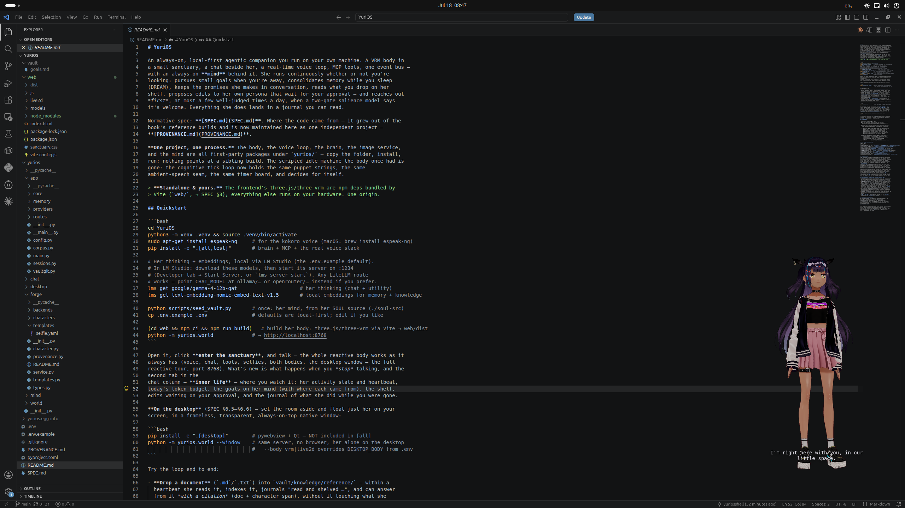

# Bodies

She has two bodies and two places to put them: a **VRM** 3D body in a rendered room, a **Live2D**
body as a lighter second option, and either one can live in a browser tab or float on your
desktop in a frameless transparent window. There is also a **text room** with no body at all,
for when a GPU isn't what you have.

Every character carries all three, and the switchboard offers all three on her card:

| Way in | URL | Costs you |
|---|---|---|
| VRM sanctuary | `/characters/<id>/sanctuary/` | a GPU: the room, her body, the post chain |
| Live2D | `/characters/<id>/live2d` | a 2D rig, no 3D scene |
| Text room | `/characters/<id>/text/` | nothing — no WebGL, no model download |

It's the same runtime behind all three: the same event bus, the same voice socket, the same
memory. Open whichever one the machine in front of you can afford.

All of it is driven from Python. The body is a puppet and the brain holds the strings: expression,
gaze, posture, visemes, weather and music are typed `avatar` events on the one event bus
([API](api.md#the-event-bus)), so a frontend is a thin view and never a second brain.

## The VRM body (default)

`http://localhost:8768/characters/<id>/sanctuary/` — a full 3D body with visemes (real lip-sync
from the audio the TTS produced), expressions, gaze, blinking and idle motion.

Her model is `web/models/avatar.vrm` with an idle animation at `web/models/idle.vrma`. To use a
different VRM, replace those files. Any VRM 0.x/1.0 model loads; expression presets are mapped by
name, and a rig missing a given blendshape degrades quietly rather than breaking.

Rebuild the frontend after changing anything under `web/`:

```bash
cd web && npm ci && npm run build
```

## The sanctuary

The room is canonical: a small room high in a stacked block over the Sprawl, low warm lamplight,
a rain-streaked window, a window seat, and one plant on the sill. The window is the hero and
faces the camera, so the neon city beyond the glass is her backdrop. She is never in a void or a
default grey scene.

It's all procedural three.js — surfaces are canvases drawn at boot, the city is a baked canvas
plus a small animated overlay, the weather is a shader, and the whole room renders through a post
chain (bloom → tone-map → grade). There are no binary scene assets in git.

The cat is furnishing that decides where to be: it picks among the room's perches, walks a path
around the furniture, and jumps at the end of it. It's unnamed on purpose — naming it is yours.

### Performance

Cost is a first-class constraint, because this GPU is usually also holding her language model —
and on a phone it's holding the browser too. The room comes in three tiers, picked for you:

| tier | when | what it does |
| --- | --- | --- |
| `full` | a desktop window | everything |
| `low` | a window under 900 px, or a large touch display | no planar floor reflection, no shadow map, no area lights, no post-AA |
| `phone` | a touch screen whose short side is 900 px or less | the above, plus a cap on drawn pixels, half-resolution bloom, one less full-screen pass, four lights instead of nine, smaller surface canvases, and fewer drops, dust motes, flyers and canvas redraws |

`?fx=full`, `?fx=low` or `?fx=phone` forces one — including upward, if your tablet is stronger
than it looks. Whatever the tier, the page also watches its own frame clock and hands back render
resolution until the frame fits, so a slow device settles at a lower resolution instead of
crawling at a high one.

`RAIN_INTENSITY` (0..1) sets the weather. She can't change it; you can.

## Live2D

A second, much lighter body at `http://localhost:8768/live2d/` (or
`/characters/<id>/live2d`). It carries the same chat column, rides the same `/api/events` bus and
the same `/ws/voice` audio socket. The Live2D body realises expressions only — it's a guest, not a
second fully-driven puppet.

### Fetching the runtime

The Cubism Core runtime and the rigs are third-party and are **not** in this repo (proprietary
Cubism Core, plus rig licensing). Fetch the runtime and sample rigs once. The default Hiyori rig
also needs the `hiyori_free_zh.zip` archive from the [Live2D Free Material
page](https://www.live2d.com/en/learn/sample/):

```bash
python scripts/fetch_live2d.py --model-zip /path/to/hiyori_free_zh.zip
```

`--airi /path/to/airi` is an alternative when a local AIRI checkout already contains that archive.

With `web/live2d/vendor/` empty the page runs voice-only and says so.

### Choosing a rig

`AVATAR_MODEL` in `.env` (or a character's `body.model` binding) picks the rig:

| Key | Rig |
|---|---|
| `hiyori` *(default)* | Hiyori Free — the rig the expression presets were tuned on |
| `miara` | ♀ full-body, Cubism 4 — the safest of the modern rigs |
| `kei`, `ren` | ♀ Cubism 5 / 5.3 rigs — need a current Cubism Core |
| `haru`, `mao`, `natori` | Cubism SDK samples |
| `mark`, `rice`, `wanko` | minimal rigs — lip-sync only |

A typo or an unfetched rig falls back to the default body, never a blank stage.
`GET /api/config` reports which rig is actually being served and which ones are installed.

## The text room — no body

`http://localhost:8768/characters/<id>/text/` (or just `/text/` on a single-character node) — a
full-screen transcript, a composer and the mic. No WebGL context is created, no VRM is
downloaded, and none of the room's code is even in the page's bundle.

Use it when the 3D room is the wrong trade: an integrated GPU, a phone on a train, a remote or
headless session, a screen reader, or a machine whose whole GPU you'd rather leave to the model.

What you keep:

- her words, with history, timestamps, selfies and the "she spoke first" marking;
- her **voice**, and yours — TTS playback, the mic, barge-in, all unchanged;
- the **inner life** tab (journal, goals, queued self-edits) and the `.env` settings panel;
- the context gauge and the first-audio latency readout;
- the [mute-her-voice switch](voice.md#muting-her), which starts **off** in here.

Telegram forwarding is configured with `TELEGRAM_SEND_NON_TELEGRAM`; see
[Channels → Cross-chat forwarding](channels.md#cross-chat-forwarding).

What you lose: the body and the room, and with them everything addressed to them — `expression`,
`gaze`, `bone`, `mouth`, and the `rain` and `music` ambience. She still emits all of it; this page
just has nothing to draw or play it on.

The links in the sub-bar go to her other two rooms, and the tab is titled `<her name> / Text` so
it's tellable apart from `<her name> / Sanctuary` when both are open.

## Desktop mode

Set the room aside and float just her on your screen, in a frameless, transparent, always-on-top
native window:

```bash
./install.sh --desktop             # pywebview + Qt — NOT in [all]; pip: -e ".[desktop]"
python -m yurios.world --window
python -m yurios.world --window --body live2d    # overrides DESKTOP_BODY
```



Same server, same page, no browser. What `--window` *means* is the page's decision: in desktop
mode the sanctuary is never built (the desktop is the room), the renderer clears to alpha 0, a
neutral light rig replaces the lamp, and the camera frames the full body. Both sockets, every
avatar command, the tools and her ambient life are unchanged. `rain` arrives as sound only.

| Knob | Default | |
|---|---|---|
| `DESKTOP_BODY` | `vrm` | which body floats: `vrm` or `live2d` |
| `WINDOW_WIDTH` / `WINDOW_HEIGHT` | 360 / 640 | portrait suits a standing VRM body |
| `WINDOW_ON_TOP` | `true` | |
| `WINDOW_GUI` | *(auto)* | `""` auto (prefers Qt/Chromium when installed) · `qt` · `gtk` |

Leave `WINDOW_GUI` on auto if you can. WebKitGTK caps `requestAnimationFrame` at ~30 fps on the
reference rig, which visibly judders her idle sway; QtWebEngine (Chromium) holds 60 and is
crisper.

### WSL

Under WSL the window has to be drawn by Windows, not by the VM — the launcher runs inside the VM,
and the desktop belongs to Windows. All it can ask Windows for is a browser window, and a browser
window (even Edge in `--app` mode) is opaque and titled.

The fix is a ~120-line Electron shell over the *same page*. Install it once, **from Windows**
(not from WSL — it fetches a Windows binary):

```powershell
cd C:\path\to\YuriOS\desktop-shell
npm.cmd install
```

Then `python -m yurios.world --window` in WSL finds `electron.exe`, works out an address Windows
can reach her on, and she floats on the wallpaper. Skip it and you still get a window — an
app-mode Edge one, opaque and titled.

`Ctrl+Alt+Y` toggles click-through. Drag her by grabbing her — the page marks its own drag
region. There's no frame to close, so use the taskbar entry or stop the launcher in WSL. Full
detail and the manual flags are in [`desktop-shell/README.md`](../desktop-shell/README.md).

## The enter gesture

The browser page gates on one click ("enter the sanctuary") before connecting its sockets, so the
`AudioContext` is user-activated and her greeting is actually audible. While she wakes, a **boot
board** shows the startup log — each service pending → loading → ready/failed/skipped, with
timings. Desktop mode auto-enters but still resumes a suspended audio context on the first click,
so the worst case is a quiet greeting, never a dead one.

The mic is a second, separate permission: click **start listening** (bottom-left) to hand the page
your microphone. Voice won't work until you do.

## The chrome

The character board, both bodies and the shared settings panel wear one design system — Inter for
prose, IBM Plex Mono for small uppercase labels, 1px rules on green-black, an acid-lime accent,
and mint/amber/red for live/near/failed. Entering a character shouldn't feel like leaving the app.

The chrome floats over the room and recedes: a topbar and a column at the edges, translucent,
never a frame around her. The camera is fixed and cinematic with subtle mouse parallax — a place,
not an asset inspector.
