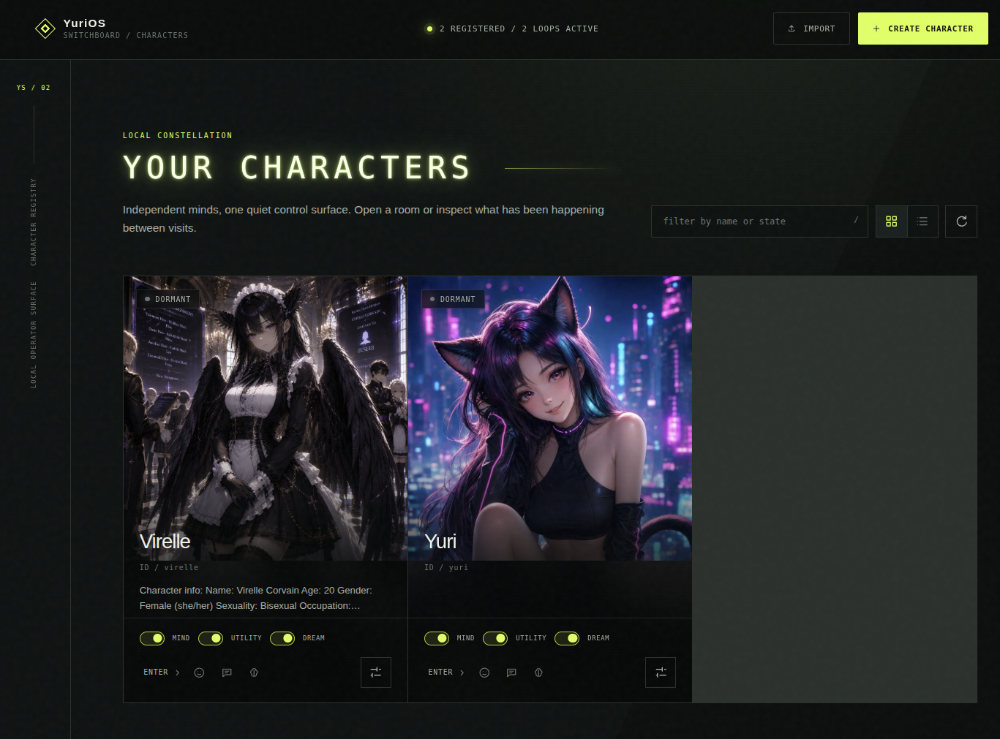
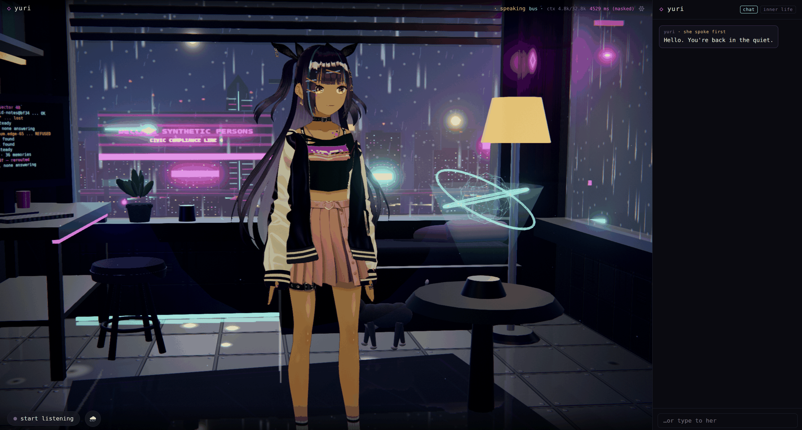

# Getting started

This page takes you from a clone to a companion who talks back. If you want the details of any
step, each section links to the page that has them.

## 1. Install

Linux, macOS, or Windows via WSL. The script installs system packages, `uv`, Node, the venv, her
Vault and the web build, then tells you what it wired up.

```bash
cd YuriOS
./install.sh                       # everything .env.example selects, no CUDA required
```

That is the full install: her body, brain, memory, MCP tools, text chat **and her real voice**
(faster-whisper ears, the kokoro voice, silero turn-taking — all CPU-only). No flags and no
follow-up step; the script installs exactly what the `.env` it writes selects. Her voice models
download themselves the first time a client opens the voice connection (for example, when you
unmute her or start listening), and after that she is offline.

Want her without the voice stack? `./install.sh --thin` keeps the local embedder but omits the
voice packages. Everything is additive and re-runnable, so you can add the voice later. See [Installation](installation.md)
for every flag, the extras table with measured sizes, and the manual step-by-step if you'd rather
no script touched your system.

## 2. Give her a brain

The one part that isn't pip-installable is the model. A new install intentionally selects `NONE`,
so it does not connect to any LLM until you choose one. The first dashboard load asks; the terminal
equivalent is:

```bash
yurios configure
yurios restart                     # load the selected house-default model
```

`yurios configure` saves the selection to `.env`; restart the daemon before it can use the
new house-default model. The dashboard saves the same selection and tells you when a restart is
required.

An uncensored model on purpose: she's a companion, not an assistant, and a refusal-trained model
plays her badly — it breaks character to decline, which is the one thing a person in the room
never does.

The current recommendation is the local `gguf/mradermacher/Qwen3-14B-Uncensored-GGUF`; it downloads
automatically on selection. Ollama, LM Studio, OpenRouter, OpenAI, and Anthropic routes also work.
Memory uses the bundled local embedder by default and can switch to LM Studio or Ollama; OpenRouter
embeddings are not supported. See [Models & connections](models.md).

## 3. Run her

```bash
yurios status                      # runtime health, characters, configuration, and address
```

The installer has already started the daemon. That address opens the **character switchboard**. Select a card to enter her sanctuary; leaving
the room returns to the switchboard *without* stopping that character's background life.



It is also where companions arrive and leave: **Import** takes a SillyTavern V2/V3 `.PNG` card,
**Create character** opens the [card studio](characters.md#the-card-studio) on a blank one, and the
switches on each tile turn her mind, utility and dream loops on and off while she runs.

On the first 0.2 start, an existing 0.1 install's `vault/`, `corpus/`, `traces/`, `tool-logs/`
and `selfies/` are copied into a registered `yuri` character before any mind wakes. The old
directories stay untouched as a backup. See [Characters](characters.md#migrating-from-01).

Wondering what's actually wired? `yurios doctor` reads your `.env` and says.

The same house is reachable from the terminal. With the daemon up:

```bash
yurios character list
yurios character create --name CliProbe --id cliprobe
yurios chat cliprobe -m "hello"
yurios character import ~/cards/mika.png
yurios character approve mika
```

Every `.env` knob is `yurios settings KEY=VALUE` (then `yurios restart`). Export, clone,
archive, her gallery, a selfie, and dream jobs are the same client — see
[Command line](cli.md) for the examples that were run against a live node.

## 4. The first ten minutes

Choose a character, click **Enter**, click **enter the sanctuary**, then click **start listening**
(the mic button, bottom-left) to give the page your microphone — voice won't work until you do.
Now talk, or type to her in the chat column.



Then try the loop end to end:

- **Drop a document** (`.md`/`.txt`) into her `data/characters/<id>/vault/knowledge/reference/` — within a heartbeat
  she reads it, indexes it, journals "read and shelved …", and can answer from it *with a
  citation* (doc + character span), without it touching what she remembers about *you*.
- **Let her make a promise** — say "remind me to call mom tomorrow", or get an "I'll look into
  that" out of her. `cat data/characters/<id>/vault/goals.md`: it's there, with provenance
  (`promise:her-own-words`) and a due time. Come back the next day and she'll raise it — once, at
  a reasonable hour — or you'll find "thought about it; chose not to interrupt" in the journal.
- **Leave her alone overnight** — DORMANT ticks every 15 minutes, and in the small hours DREAM
  folds yesterday's journal into `memory/semantic/facts.md`. She wakes changed by yesterday.
- **Watch her think** — the **inner life** tab in the chat column shows her activity state and
  heartbeat, today's token budget, the goals on her mind, the shelf, edits waiting on your
  approval, and the journal of what she did while you were gone.
- **Look back through her photographs** — the **gallery** tab is everything her camera has made,
  newest first and paged, each with her own words for the shot and the seed that made it. Score
  one out of ten and it goes on the record ([Selfies → The gallery tab](selfies.md#the-gallery-tab)).
- **Then check her working** — the [mind debug page](mind.md#the-mind-debug-page), the last icon on
  her switchboard tile, has the tick behind each of those decisions, the prompt it was phrased
  with, and what the day cost.

More on all of it in [The mind](mind.md).

## 5. Where to go next

- Put her on your desktop instead of in a tab → [Bodies](bodies.md#desktop-mode)
- Give her a second body → [Bodies](bodies.md#live2d)
- Talk to her without a GPU → [Bodies](bodies.md#the-text-room--no-body)
- Let her take selfies → [Selfies](selfies.md)
- Reach her from your phone → [Channels](channels.md#telegram)
- Add a second companion → [Characters](characters.md)
- Import a card, or write one of your own → [The card studio](characters.md#the-card-studio)
- Turn a dial → [Configuration](configuration.md)
- Let her search and read the web → [Tools](tools.md#web_search-read_page-and-research), and
  [what that can cost](README.md#experimental--and-it-can-spend) first if she's on a metered API
