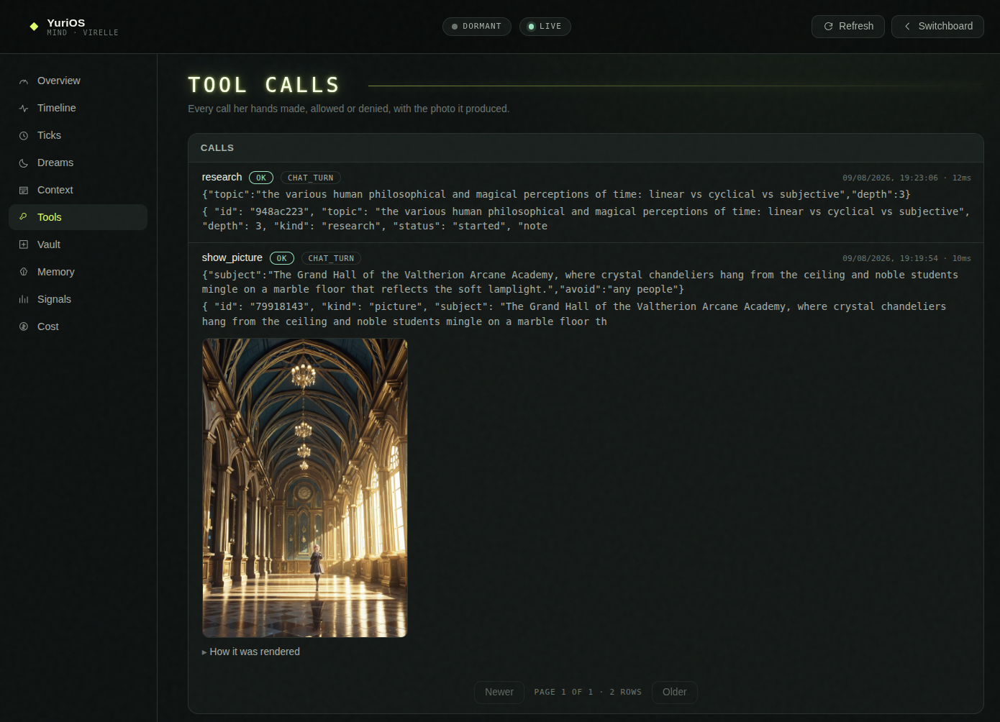

# The mind

The reactive companion — voice, chat, tools, a body — exists only while you're talking to her.
The **mind** is what runs the rest of the time: a loop that ticks whether or not anyone is
looking, pursues small goals, keeps the promises she made, reads what lands on her shelf,
consolidates memory while you sleep, and now and then decides to reach out first.

It's additive. `MIND_ENABLED=false` gives you the reactive companion minus ambient life, and
conversation never depends on it. Timer expiries currently use the mind loop for delivery, so
enable the mind and select a model if they must be announced or queued.

> **Experimental.** This is a reference implementation of *initiative*, not a hardened product.
> Much of what's on this page is new and still moving between releases — DREAM, self-edits, her
> desk, the shelf — and all of it spends model calls with nobody watching. Meet it with a local
> model first, mind the [budget governor](#the-budget-governor) and what it does *not* do, and
> read [the cost note](README.md#experimental--and-it-can-spend) before pointing her at a metered
> API.

Normative detail: [`SPEC.md` §15–§25](../SPEC.md).

## The tick loop

Every heartbeat runs six phases:

| Phase | What happens |
|---|---|
| **SENSE** | drain the signal inbox, scan the shelf, fold everything into the world model |
| **APPRAISE** | score everything with cheap heuristics — *never* a model |
| **DECIDE** | commit to exactly one act, or to resting |
| **ACT** | reach the world only through surfaces the host already owns |
| **REFLECT** | journal it; scan her own reply for promises |
| **REGULATE** | drift the activity state, debit the budget, commit the Vault if anything changed |

Three rules hold it together:

1. **One intention per tick.** Most ticks end in REST, and that's the design. An agent that does
   one thing per heartbeat can be read like a diary — and is.
2. **APPRAISE never calls a model.** That single rule is what makes always-on affordable; the
   model is invoked inside ACT, for work already judged worth it.
3. **Everything is journaled and traced**, and every tick that changed the Vault ends in exactly
   one git commit. An uneventful tick commits nothing.

Time is injected everywhere — no wall-clock reads, no bare sleeps — which is why days of an
always-on mind can run in milliseconds in the test suite.

### Conversation stays on the fast path

The reply pipeline (ears → brain → voice, with barge-in and the latency budget) is untouched by
all this. No tick cadence sits in front of it. The loop is its *observer and consequence*: a user
turn preempts the activity state to ENGAGED from any state, and the committed exchange comes back
as a signal whose REFLECT share is the world-model update and the promise scan. One mind, two
cadences.

## Signals

Everything that happens *to* her is one typed, timestamped signal appended to one inbox:
`user_message`, `turn_committed`, `user_present`, `user_absent`, `timer`, `task_completion`,
`selfedit_decision`, `wakeup`, `fs_event`, `suspend_gap`. Producers post facts; the loop decides
what they mean.

Each arrival appends a line to `signals.jsonl` — "what woke her at 3 a.m." is a file you read.

## Activity states

An always-on mind is affordable only because it's almost always nearly asleep.

| State | When | Cadence |
|---|---|---|
| **ENGAGED** | talking | `MIND_ENGAGED_CADENCE_S` (10 s) |
| **IDLE** | you were recently around — goal work happens here | `MIND_IDLE_CADENCE_S` (60 s) |
| **DORMANT** | long quiet | `MIND_DORMANT_CADENCE_S` (900 s) |
| **DREAM** | consolidation, entered from DORMANT inside a local-time window | `MIND_DREAM_CADENCE_S` (120 s, chunked) |

Everything except the preempt is a slow drift *down* the cost ladder on configured timeouts
(`MIND_ENGAGED_TIMEOUT_S`, `MIND_IDLE_TIMEOUT_S`). A user turn is the only thing that moves up it,
and it does so from any state, mid-sleep if necessary. The state persists and resumes across
restarts.

**Rehydration.** Her cursor state survives a restart — a rebooted mind resumes rather than waking
amnesiac. A real gap since the last tick (a machine that was off for ten hours) synthesizes one
`suspend_gap` signal: one catch-up appraisal over the whole gap, one journal line. Never a pile of
stale reactions, and never thirty good-mornings.

## The budget governor

```ini
MIND_DAILY_TOKENS=200000
```

Estimated tokens spent today are held against a daily cap, debited by every utility call and every
line the mind composes. At pressure ≥ 1.0, REGULATE sheds IDLE to DORMANT and goal work stops.

It **never** gates conversation. A governor that silences her when you speak has failed at its one
job. The ledger rolls at local midnight and is rendered in the inner-life tab.

**It is a governor, not a spend cap**, and the difference matters if she is on a metered API. The
number is an *estimate* of tokens, not a bill; pressure changes what the loop chooses to do next
rather than stopping work already under way, so it will not abort a long read in flight; and it
does not stand between a tool call and the run it starts — a `research` call you provoked in
conversation goes ahead at any pressure. The hard bounds are `RESEARCH_MAX_PAGES`,
`TOOL_RATE_RESEARCH`, and the stop button on the inner-life tab.

## The two gates

This is the make-or-break component, and collapsing the two thresholds is precisely the
always-interrupting-assistant failure.

**Gate 1 — salience to act** runs every tick over every sensed signal and every open goal, plus
the standing impulses (a pending announcement, a new document, DREAM backlog, the murmur). Pure
heuristics: a base score per signal type — nothing outranks the person speaking — plus a surprise
bonus from violated expectations. Below `MIND_ACT_THRESHOLD` (0.4) the tick rests, and most do.

**Gate 2 — salience to interrupt** is scored *only* when a reach-out goal has already crossed gate
1. It's built from named factors the trace records verbatim: relevance, time-sensitivity, hours
since she last reached out, inferred availability by hour, and a welcome term that decays with
each interruption today.

Two things are **hard gates, not weights**:

- quiet hours (roughly 22:00–09:00) are silent regardless of score, and
- `MIND_MAX_INTERRUPTS_PER_DAY` (3) zeroes the score outright.

Three outcomes, in ascending imposition:

| Outcome | What it does |
|---|---|
| **SILENT** *(the default)* | do it quietly and journal it. The journal, not notifications, carries the value |
| **SUGGEST** | one composed line posted to the chat, waiting for your next glance — never spoken |
| **SPEAK** | aloud through the ambient seam if a page is open; a `proactive` chat line if the room is empty |

Both dials are yours, in `.env`. You cannot tune the dial against someone who holds it.

### Where a reach-out actually goes

The gate decides whether she speaks. It does not decide whether you hear it, and those used to be
the same thing by accident: a SUGGEST line, or a SPEAK with no page open, was published to the
event bus and appended to an in-memory transcript. With nobody watching and no Telegram bot
configured, that had no subscribers and did not survive a restart. She spent one of three
interruptions on an empty room.

So a line she started, into a room that may have been empty, is also filed in her **inbox** —
`vault/state/inbox.json`, on disk, per character. It waits there until you have been in her room
to see it; the switchboard marks her tile meanwhile, and the chat shows the run under a *while you
were away* rule when you walk in. Turning on `NOTIFY_ENABLED` adds a desktop notification at the
moment she says it. See [Channels → Desktop notifications](channels.md#desktop-notifications).

The rule at the top of this table is unchanged by any of that: the journal, not notifications,
carries the value. Nothing was added that decides to interrupt you. What was added is that when
she has already decided to, it arrives.

## The world model

Her picture of *now*. Every entry is a time-stamped, confidence-tagged **belief** in an append-only
log, so "what was believed when" is answerable. Structured now-state carries presence, last
contact each way, open threads and expectations.

`situation()` composes the host's lines (the time, the embodiment truth, the room's scene state,
pending timers) with what only a store can know: whether you're here, how long you've been away,
what's in progress, what she half-expects. It's written to `vault/world/situation.md` whenever it
changes — her picture of now is a file you can `cat` — and it's what every prompt carries.

The embodiment truth in there names a *place*, and the place is hers: `vault/world/setting.md`,
read out of her character card when she was imported and rewritten into second-person prose by
the utility model. Before this existed every character was told, every prompt, that she lived in
the shipped companion's room above the Sprawl. Edit it by hand or in the card studio's Scenario
section — `situation.md` is derived and gets overwritten, `setting.md` is yours and does not.

**Expectation and surprise:** she can store a checkable belief about what comes next. An
observation that matches resolves it quietly; one that finds it past due produces prediction
error, and that surprise feeds APPRAISE as a salience bonus — the cheapest good salience signal
there is.

## The shelf (drop-folder RAG)

Drop a `.md` or `.txt` file into her Vault's `knowledge/reference/`:

```bash
cp notes.md data/characters/yuri/vault/knowledge/reference/
```

Within a heartbeat she notices it (a cheap size+mtime scan), ingests it — chunked by paragraph
budget, each chunk situated with a short blurb, embedded, and hybrid-indexed (vector similarity
blended with keyword idf) — and journals "read and shelved …". Re-ingesting a changed file
replaces its chunks rather than duplicating them.

**A long document is read for notes instead.** Word-for-word ingestion costs a utility call and an
embedding per 1,200 characters, which is right for a page and ruinous for a book — the 365,000-character
encyclopaedia article one `research` call brought home is 379 chunks, i.e. 758 calls to the one model
on this machine. Past 40,000 characters she switches to one précis per section (~8,000 characters,
growing for a very long document so the call count stops climbing): ~140 calls instead of ~1,000 for
that research run. The file is still kept whole on the shelf — only the index becomes notes — the span
still points into the real document, and the citation says `summarised` so she doesn't offer her own
paraphrase as a quotation. With no utility model configured there is nothing to summarise with, so
long documents fall back to plain chunking, which is cheap there anyway.

Retrieval is **grounded**: every returned chunk carries its document and a character span, so she
can cite what she's telling you.

And it runs on **every turn**. Whatever you just said is searched against the shelf, and the best
few chunks go into the system prompt as a **WHAT YOU'VE READ** block with their citations — so a
book you dropped in last month, or a page she looked up herself, is available to the sentence
she's about to say. `KNOWLEDGE_K` (default 3) sets how many; `KNOWLEDGE_K=0` turns the slot off
and leaves the shelf as an archive you can still search by hand. If the search fails — no
embedder, a half-written index — she loses the block, not the reply.

Knowledge is a sibling of memory, never folded into it, and the boundary is enforced by shape:
**knowledge cites a document; memory cites a conversation turn.** The book you dropped in is
knowledge; "you told me you play bass" is memory. A document she read never becomes something she
believes about *you*.

A doc that fails to ingest (no embedder, a mangled file) is marked seen with one loud warning and
retried only when the file changes — a broken shelf item never becomes a retry loop. The index is
derived, gitignored and rebuildable.

**You can watch it, and you can stop it.** Reading is the most expensive thing she does on her own
initiative — a `research` tool call answers in milliseconds and then spends the next half hour of
your machine — so the **inner life** tab carries a reading block: the document being read right now
with a bar and a `12 / 48 passages · 24 of ~96 model calls` line, each research run with its pages
and what they're priced at, and a **stop** button.

Stopping loses nothing. The passages she has already read stay in the index and stay citable; the
document stays on the shelf; pages a run had fetched but not yet read are shelved *held* rather
than dropped, so resuming is reading rather than fetching all over again. A held document is not
pending work — no heartbeat will touch it — until you press **resume**, and a resumed read carries
on from the passage it stopped at rather than starting the book again. (A stop lands after the
section she is on, never in the middle of a model call.)

**One reader at the shelf.** A doc is claimed the moment its ingest starts rather than when it
finishes, so a page `research` just shelved doesn't also look like pending work to every heartbeat
in the minutes it takes to read; a caller arriving while it's claimed takes the shelved answer
instead of repeating the work, and a tick that finds her already reading steps aside rather than
queueing. A run that fails or is cancelled hands the claim back.

## DREAM

She wakes changed by yesterday.

In the DREAM state — entered from DORMANT inside `MIND_DREAM_START_HOUR`..`MIND_DREAM_END_HOUR`
(02:00–06:00 by default) — each tick chews what `MIND_DREAM_TICK_TOKENS` allows: **finished** days
of the episodic journal (never today's live file) are summarised to at most a few durable facts,
deduped against `memory/semantic/facts.md`, appended there with their source day, and indexed at
higher salience so recall prefers the distilled fact over the raw exchange.

It's oldest-first and resumable: a night that runs out of budget leaves a backlog, not an overrun,
and the next DREAM tick picks up where it stopped. The night's work is journaled — "slept on it:
folded … into what I keep".

### More than one thing happens at night

Consolidation is the first job, not the only one. DREAM is a **pipeline** (`mind/dreamjobs.py`):
each tick runs the enabled jobs in priority order, sharing one token budget, and yields.

A job reads the journal through `relabel()`, which rewrites the two speakers as **ME** and
**THEM**. The journal's own `you:` means the *other* person — correct for a human reading her
diary, and unusable under a prompt that opens "You are Yuri", where the same word points at two
people and she loses her own side of the transcript. The halves are positional, so the rewrite
needs neither name.

What a night does with her hands — a desk write, a picture sent to the camera — lands in
`tool-logs/calls.jsonl` beside her daytime calls, so the Tools page covers the unattended hours
too. Dry runs make no calls and log none.

A job prices a day by the prompt it will send, not by the journal on disk — a day's journal is
capped before it reaches a model, so a talkative 180 KB day is still a ~1.7k-token call. And a job
that runs out of room stops itself, not the night: the cheaper jobs behind it get their own turn at
the same ceiling. Together those two rules are why an ordinary night finishes in one tick.

| Job | When | What it does |
|---|---|---|
| `consolidate` | per finished day | the pass above — journal → durable facts |
| `diary` | per finished day | a short private entry in `workspace/diary/YYYY-MM-DD.md` — what the day was *like*, not what happened in it |
| `strategy` | once a night | stands back from the open goals and writes `workspace/strategy/` — what matters, what's stale, what's next |
| `selfie` | once a night | picks the moment from the day that wants a picture and sends it to the camera (absent entirely when `SELFIE_BACKEND=off`) |

Each job keeps its own resumable ledger, so adding one to a vault with six months of history gives
it a six-month backlog it eats a night at a time. A job that fails is caught, retries tomorrow, and
does not take the rest of the night with it. Jobs write to `workspace/` — never to `memory/` or
`soul/`; a nightly job that could append to semantic memory would be a second, unaudited
consolidator.

### The roster is hers

The night is not fixed. One file per job lives in `vault/dreams/`, versioned like `skills/` and
unlike her desk, and each is YAML frontmatter over a body that **is** the system prompt she is
given. A file named after a built-in job (`consolidate`, `diary`, `strategy`, `selfie`) *retunes*
it — the prompt, the priority, whether it runs at all — and leaves its behaviour alone, so the
diary still knows which half of the journal is hers however you rewrite the question. A file with
any other name is a new job, and `kind:` says what sort it is.

**`kind: prompt`** (the default) reads the day's journal, asks what you asked, and writes the
answer to her desk at `output:`.

**`kind: research`** sends her to the web instead. She plans her own searches, opens what looks
worth reading, and writes the report your body asks for — so for this kind the body is the brief
for the *report*, not for the search. It needs `SEARCH_BACKEND` on, everything she reads is
shelved in her knowledge store, and the night is bounded on every axis: `max_searches`,
`max_pages`, `max_steps`, each capped in turn by the house `MIND_DREAM_RESEARCH_*` settings. Those
three have to be spendable together — moves cover the searches, the pages and the thinking in
between — or the night always ends mid-gather instead of when she decides she has enough. It
also carries its own token budget, because a night of reading the web on one shared ceiling either
never fits or eats consolidation on the night it does.

She cannot search the same thing twice, and "the same thing" is judged on the words that carry
the meaning rather than on the exact string — the wasted move is never a repeat, it is one word
swapped after a dead link.

The report at the end is the one call in the night that gets a reasoning pass — which page to
open next is not a question thinking improves, and the rounds go without one precisely so this one
can afford it. The limit that bites first on a local model is not a token count but the clock: a reasoning pass
over a night of reading takes minutes, and the HTTP client's ordinary ten-minute deadline killed a
report that was still being written after thirty-six — ten thousand tokens of thinking, then a
page. So the writing call carries its own
`report_timeout_s` (default 3600) while the rounds keep the ordinary one — their answer is one
line, and a round that hangs is a night that never finishes.

How long the report itself may be is `report_max_tokens`, and room to think is added on top of it
— because a ceiling bounds the call and not the pass inside it, and given 2,500 tokens for both,
one 27B put all 2,500 into its own reasoning and answered with an empty string. If that still
happens the report is asked again with whatever the context window has left, and
the shortest reasoning pass it can ask for — more room and a shorter pass, never no pass.
`report_effort` (`low` / `medium` / `high`) asks for that shortening up front, on a server that
implements it; the same 27B ignored it completely, so it is a hint rather than a limit.

Two frontmatter keys are worth knowing whichever kind you pick. **`standing: true`** runs a job
every night whether or not you spoke to her — anything looking at the world rather than at the
conversation needs it, because a day nobody talked is not a day her journal has. And
**`deliver: chat`** puts the finished document where you will find it the next time you open her
chat, the way a dream selfie arrives; only the newest waits, so a week away is one report and not
seven.

```yaml
---
name: market-brief
title: Overnight market brief
kind: research
standing: true
deliver: chat
topics: ["US equities momentum", "macro calendar"]
max_searches: 10
output: reports/market-brief/{day}.md
---

You are {char}. Write {user} their morning brief...
```

Adding a whole new *kind* of night is one class in `mind/dreamjobs.py` and one name in
`JOB_KINDS`; adding a built-in job is one class and one name in `BUILTIN_JOBS`. Everything else —
the ladder, the trace, the budget, the debug page, the manual trigger — picks either up untold.

### Trying one without waiting for 3am

A dream job is a prompt that runs overnight and whose only output is a file that appears tomorrow,
which makes a day the natural unit of iteration. The mind debug page's **Dreams** section shortens
that to a click: pick a job, pick a day, leave *dry run* on, and you get back the exact system
prompt, the exact input and the raw completion — with nothing written, no day marked done, and no
commit.

```
/characters/<id>/mind#/dreams
```

Turning dry run off lets a run count. Either way the ladder does not move: a night you asked for is
not evidence she drifted into one.

The same section edits the files. Every job carries an **Edit** button over its own
`vault/dreams/<name>.md`, and **New prompt job** / **New research job** scaffold a working one to
start from. A save rebuilds the roster immediately — no restart — and commits, so your first edit
to a seeded job reads as a diff. Deleting a built-in's file reverts it to the prompt that ships
with YuriOS; deleting anything else stops it being a job at all, and the seeder will not bring it
back (it only ever fires on an absent *folder*).

For a research job the run report also lists **every search she ran and every page she opened**,
beside the model calls rather than mixed into them — a report is only readable if you can see the
corpus behind it.

## Her desk and her skills

Every other write path in the mind is narrow on purpose — `memory/` is grown by DREAM, `world/` by
SENSE, `soul/` only through the gated self-edit flow. That's the right shape for the things she
*is*, and the wrong shape for the things she is *doing*.

**`vault/workspace/`** is her desk: a corner of the Vault with no schema and no ceremony, which she
reads and writes freely through `list_notes` / `read_note` / `count_note_lines` / `write_note` /
`append_note` / `edit_note` / `delete_note`. Drafts, research scratch, the middle of a thought.
You can drop files in too.

**`vault/skills/`** is the same primitive pointed at instructions. One folder per skill, each with
a `SKILL.md`:

```markdown
---
name: tea-timer
description: when they ask to steep something
author: you
enabled: true
---

Ask which tea first, then set the timer for...
```

The `description` is the load-bearing field. Every turn carries a one-line catalog — name plus
when-to-reach-for-it — and the body loads only once she has decided this is the skill the moment
calls for, through `read_skill`. Twenty skills cost twenty lines of context until one is used. She
can write her own with `write_skill`; you can drop them in by hand.

Both live inside the Vault and travel when you copy her folder, but only skills are **versioned**.
The desk is deliberately not: scratch churns, and a draft rewritten four times while she works
something out would be four commits of a diff nobody reads — the Vault's `git log` is the diary of
how she grew. A skill, by contrast, is a durable statement about how she does something, and worth
being able to read back and revert. `workspace/.gitignore` carries the rule from inside the folder,
so existing vaults get it without a migration.

The sandbox is dull and absolute: relative paths only, no `..`, no dotfiles, symlinks resolved
*before* the containment check, and per-file/whole-tree/file-count ceilings. Nothing in there
executes; the coming code harness gets its own workspace **outside** the Vault precisely so that
"she can write here" and "this can run" never become the same sentence.

## Goals and promises

`vault/goals.md` is the store, and it's a human-readable markdown checklist on purpose: what an
agent intends to do should be a file you can open.

```bash
cat data/characters/yuri/vault/goals.md
```

Each goal carries a kind, a priority, an optional due time, its **provenance**, and a **commitment
strategy**, and moves `pending → active → waiting → done | abandoned`.

Goals come from three designed sources:

| Provenance | Where it came from |
|---|---|
| `user:remind-me` | your explicit asks, scanned from your turns |
| `promise:her-own-words` | **her own promises** — REFLECT scans every committed reply for first-person commitments ("I'll look into that") and files each as a reach-out goal with a due time |
| maintenance | DREAM backlog, shelf drops |

A companion who forgets her own promises is worse than one who forgets yours. Near-duplicate open
goals merge rather than multiply.

**Commitment governs staleness.** `blind` is defended past due (a birthday is a birthday);
`single-minded` drops only when it's moot; `open-minded` is abandoned the moment it stops being
timely.

## Self-edits

Who she is, immutably; who she's becoming, reviewably.

`soul/CONSTITUTION.md` is **read-only, even to her** — every mind write goes through a vault layer
that refuses it unconditionally, and the self-edit flow won't even queue a proposal against it.

Everything else is risk-gated:

- **Low risk** (memory, world, knowledge, goals — her working products) applies immediately and
  commits.
- **High risk** (any `soul/` surface, and every *unknown* surface — fail safe) is **queued** with
  its full content and reason, and rendered in the inner-life tab with approve/reject.

Your decision comes back as a signal the loop consumes on its next tick. Applied edits are git
commits, so drift is never silent and `git revert` undoes any of it. Your ruling is journaled too
— "you applied/rejected my edit to …".

## The journal is the product

Her acts write into the **same episodic day files as the conversation**, as `[she]` lines — one
journal, two authors, one DREAM pass over both. Each line is indexed into memory (she can recall
her own past acts) and published live on the event bus.

"What did you do while I was gone?" is a page you open, not a vibe.

```bash
tail -f data/characters/yuri/traces/ticks.jsonl        # one record per heartbeat
git -C data/characters/yuri/vault log                  # one commit per tick that changed anything
```

The **tick trace** is the why-record behind the journal: sensed, appraised (with scores), decided
(with runners-up), acted, and every interrupt decision with its factors. The scenario tests are
queries over this file, and the answer to "why did she…" is always in it.

## The inner-life tab

The chat column's second tab, refreshed live off the same event bus:

- her activity state and heartbeat,
- today's token budget,
- the goals on her mind, with where each came from,
- the shelf,
- edits waiting on your approval, with content and one-click approve/reject,
- and the journal.

Everything reads *through* the mind's own stores — the dashboard can never disagree with the
files. The same data is available at `GET /api/mind`, `/api/mind/journal`, `/api/mind/trace`
([API](api.md#the-mind)).

## The mind debug page

The inner-life tab is the *product* half of autonomy — what she did, in her words. The debug page
at `/characters/{id}/mind` is the other half: every mechanism behind it, on one surface. Reach it
from the last of the four ways in on her switchboard tile, and **Switchboard** in the header is the
way back.



Ten sections down the left — **Overview**, **Timeline**, **Ticks**, **Dreams**, **Context**,
**Tools**, **Vault**, **Memory**, **Signals**, **Cost** — and two chips in the header that mean
different things: the rung she is on, and whether this page's own event stream is `live` or
`offline`. The second one going offline changes nothing about what you can read; the files are
still there.

- the **overview** — what is on disk for her, read without starting her: the state, the budget,
  the Vault head, row counts, and a manifest of every log with a `rotated` flag, because a page
  that reads only the live file should say so when an older one exists;
- the **activity timeline** — every ENGAGED/IDLE/DORMANT/DREAM transition she actually made, with
  the rung that fired it (`traces/activity.jsonl`, appended only on a real change);
- the **tick traces**, in full — sensed, appraised with scores, decided with runners-up, acted,
  and the interrupt decision with its factors, which the tab summarises and the `/log` view throws
  away;
- **every context window she was ever given** — not just committed turns. Self-talk, the arrival
  greeting, a reach-out being written, goal work and DREAM consolidation all call a model, and
  before `traces/prompts.jsonl` none of them left any record of what they were asked;
- her **tool calls**, allowed and denied, with the arguments she passed, the verdict, the latency,
  and the photo each produced joined on the correlation id rather than guessed at by timestamp —
  *how it was rendered* unfolds that photo's provenance record, and a row that came from a tick
  links straight to it;
- the **dream jobs** — what ran last night, what each still owes, and a way to run one now rather
  than waiting for 2 a.m. to come round again;
- the **Vault's own history** — the commit list, any file now or at a revision, and every edit to
  one file (`soul/USER.md` is the usual reason you came);
- the **recall index**, her semantic facts, beliefs, and the knowledge shelf;
- and **what it costs** — context pressure over time, the budget, and what the small model
  produced versus what was quarantined.

Two things make it useful where the tab is not. It reads **files, not a running mind**, so a
stopped or crashed character is fully inspectable — the moment you most need it, and exactly when
`/api/mind` answers `503`. And one `corr_id` per unit of work (`world/correlate.py`) ties the four
separate logs into one story, so "why did she take that photo" walks from the tick that decided it
to the prompt that phrased it to the audit line that ran it.

## The knobs

```ini
MIND_ENABLED=true                 # off = the reactive body, minus ambient life
MIND_SEED=0                       # 0 = unseeded; tests pin a seed
MIND_ACT_THRESHOLD=0.4            # gate 1
MIND_INTERRUPT_THRESHOLD=0.75     # gate 2 — YOUR dial
MIND_MAX_INTERRUPTS_PER_DAY=3     # the hard daily cap
MIND_CONSIDER_COOLDOWN_S=3600     # minimum gap between re-chewing one goal
MIND_DAILY_TOKENS=200000
MIND_DREAM_TICK_TOKENS=40000
MIND_TRACE_MAX_BYTES=2000000       # rotate traces/ticks.jsonl to ticks.jsonl.1 at this size
MIND_ENGAGED_CADENCE_S=10
MIND_IDLE_CADENCE_S=60
MIND_DORMANT_CADENCE_S=900
MIND_DREAM_CADENCE_S=120
MIND_ENGAGED_TIMEOUT_S=180        # quiet this long → IDLE
MIND_IDLE_TIMEOUT_S=3600          # away this long → DORMANT
MIND_DREAM_START_HOUR=2
MIND_DREAM_END_HOUR=6
```

Body reflexes and the murmur keep the old idle machine's windows:

```ini
IDLE_SETTLE_S=20                  # quiet after a turn before ambient life resumes
IDLE_ACT_MIN_S=8                  # reflex window: gaze drift, expression pulse, posture
IDLE_ACT_MAX_S=25
IDLE_TALK_MIN_S=120               # the self-talk impulse: one short in-character line
IDLE_TALK_MAX_S=300               #   after this much quiet
```

The murmur only happens in IDLE, only with you present, only after the quiet window — and it's
dropped rather than queued when nobody can hear. Body reflexes run on a seeded RNG with no model
and no journal, and stay silent while she's engaged, while the room is empty, and in
DORMANT/DREAM.

Per-character overrides: the `mind`, `utility` and `dream` switches live in the registry, so one
companion can be fully autonomous while another stays reactive-only —
see [Characters](characters.md#loop-switches).

## What the mind deliberately doesn't do

- **No tool calls.** Her hands stay conversational; a tool-bearing autonomous act needs a
  broker that comes with the sandboxed workshop.
- **No code execution, no shell, no autonomous research-and-build.**
- **No multimodal sensing** — SENSE reads text, time, files and its own completions.
- **No temporal knowledge graph** — the world model stops at the snapshot.
- **No affective state model** — the reflex pulses approximate warmth without modelling it.

These are named omissions, not gaps waiting to be discovered ([`SPEC.md` §26](../SPEC.md)).
