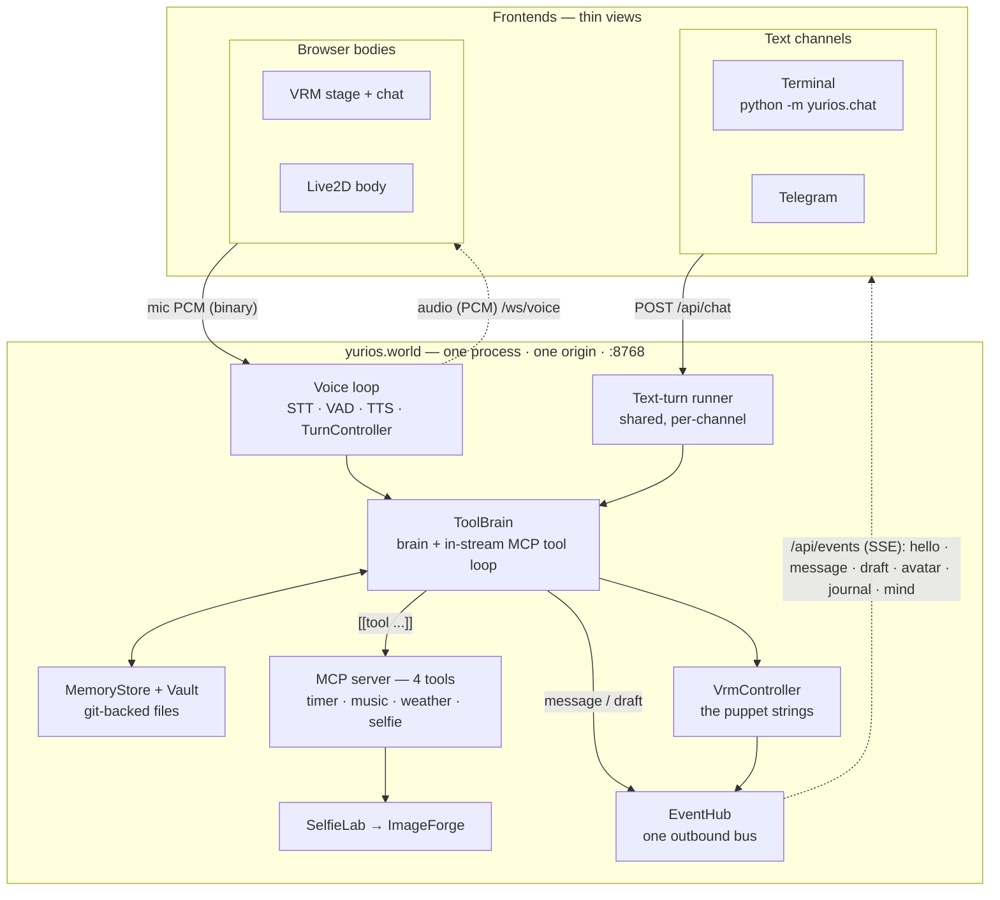
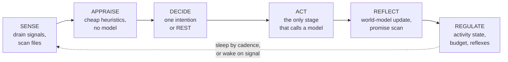
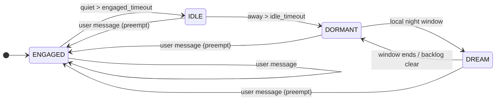
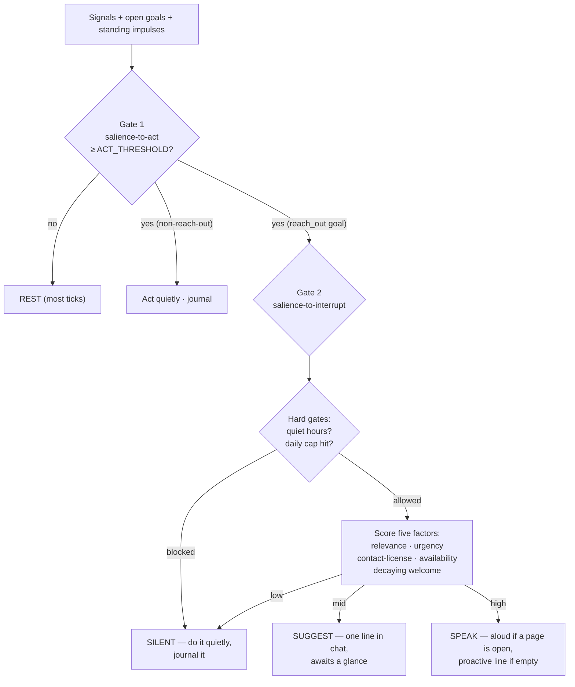

# YuriOS: An Always-On, Local-First, User-Owned AI Companion Runtime

**A technical white paper**

*The YuriOS Project · v1.0 · July 2026*

Project: <https://github.com/> (this repository) · Normative spec: [`SPEC.md`](../SPEC.md) · Code provenance: [`PROVENANCE.md`](../PROVENANCE.md)

---

## Abstract

Most AI "companions" available today are hosted services: the model, the memory, and the
persona live on a vendor's servers, behind a subscription, subject to silent change. This
architecture produces two recurring failures — the **rug-pull** (a personality or capability
users depend on is altered or removed overnight) and the **request/response ceiling** (the
companion exists only for the duration of an API call and is otherwise inert). YuriOS is a
reference runtime that takes the opposite position on both. It is **local-first** (the model,
the memory, and the voice all run on the user's own hardware; nothing is required to phone
home), **file-native** (the companion's entire mind is a git-backed folder of human-readable
files — the files *are* the database), and **always-on** (a cognitive tick loop runs
continuously, so the companion pursues goals, consolidates memory, and decides — under a
conservative two-gate salience model — when to speak first). This paper describes the
motivation, the design principles, the system architecture of the reactive "body," the
autonomy engine that constitutes the "mind," and the concrete reference implementation. It is
self-contained: a reader with access only to the YuriOS repository and this document has
everything needed to understand the system.

**Keywords:** AI companions, autonomous agents, BDI, agent memory, retrieval-augmented
generation, local-first software, human–AI interaction.

---

## 1. Introduction

An AI companion is a persistent, personified conversational agent whose value is the
*relationship* rather than any single task it completes. Commercial companion products
(Replika, Character.AI, and successors) have demonstrated large, durable user demand, but
they share a structural weakness: the companion is a tenant on infrastructure the user does
not control. The consequences are well documented. When a vendor changes a model, revises a
safety policy, or sunsets a feature, users experience it as a bereavement — the entity they
had a relationship with is silently replaced. Because the "memory" and "personality" are rows
in the vendor's database, the user cannot inspect them, cannot export them, and cannot prevent
their alteration.

A second, quieter limitation is architectural. Almost every deployed companion is a
**request/response** system: it computes only while answering a message and is otherwise a
static record. It cannot pursue an intention across time, cannot notice that it promised to
follow up, cannot reflect on yesterday, and cannot reach out first in a way that is more than a
scripted engagement notification. It has, in the technical sense, no *initiative*.

YuriOS is an open reference implementation built around three commitments that jointly address
both failures:

1. **Sovereignty.** The model, the memory, the voice, and the persona run on the user's
   machine. Pulling the network cable does not change behaviour once local models are
   installed. There is no server-side "real" copy of the companion to be changed underneath
   the user.
2. **Transparency by construction.** The companion's mind is a directory of markdown files
   under version control. "What does she know about me, and when did that change?" is answered
   by `cat` and `git log`, not by a support ticket. A self that is open files on your disk
   cannot be silently A/B-tested against you.
3. **Initiative under user-held control.** An always-running cognitive loop gives the companion
   genuine autonomy — goals, consolidation, promise-keeping, and proactive contact — but every
   dial that governs *when she may impose on the user's attention* is a value in a config file
   the user owns.

**Contributions.** This paper contributes (i) a design rationale connecting local-first,
file-native, and always-on into a single coherent architecture; (ii) a description of a
**two-cadence cognitive architecture** in which a sub-second reactive turn pipeline and a
continuous tick loop share one mind and one file-backed store; (iii) a **two-gate salience
model** that separates *deciding to act* from *deciding to interrupt*, which we argue is the
central design problem of a proactive companion; and (iv) a complete, running reference
implementation with a deterministic, simulated-time test methodology.

---

## 2. Background and Related Work

### 2.1 Companion systems and the rug-pull problem

Companion products are distinguished from task assistants by three properties: a stable
identity, long-horizon memory, and a one-to-one relationship with no audience. Field analysis
of large character-card corpora shows that the durable, "sticky" archetypes are defined by
warmth and consistency rather than novelty. Yet the dominant deployment model — a hosted
service with a proprietary memory store — makes exactly those properties fragile. The most
cited grievances in companion communities cluster around discontinuity: a model swap that
changes the companion's voice, a policy change that removes a capability, or a shutdown that
deletes the relationship entirely. YuriOS treats *non-discontinuity* as a first-class
requirement and derives it from ownership: if the mind is files on the user's disk under git,
there is no lever a third party can pull.

### 2.2 Agent architectures: from workflows to always-on loops

A useful distinction (following widely adopted industry guidance) separates **workflows** —
LLMs orchestrated along predefined code paths — from **agents** — systems in which an LLM
dynamically directs its own process and tool use. Reactive conversation is almost pure
workflow: load persona → retrieve memory → generate → respond. The **ReAct** pattern (reason →
act → observe, in a capped loop) is the canonical agent primitive for tool use [Yao et al.,
2023].

Neither pattern, however, describes an entity that runs *between* requests. For that, YuriOS
draws on the **Belief–Desire–Intention (BDI)** tradition of practical-reasoning agents
[Bratman, 1987; Rao & Georgeff, 1995]: an agent maintains *beliefs* (a model of the world),
*desires/goals*, and *intentions* (committed plans), and cycles through sensing, deliberation,
and action. Classical BDI ran on symbolic planners; YuriOS realises the same decomposition
with an LLM in the deliberation and action stages and cheap heuristics everywhere else, and
adds an explicit **commitment strategy** per goal (blind / single-minded / open-minded) to
govern when an intention is abandoned — a direct descendant of the BDI literature's treatment
of commitment. The persistent-process framing echoes cognitive-architecture work (Soar, ACT-R)
in which an agent is a continuously running interpreter rather than a function call.

### 2.3 Memory and knowledge

Agent memory is conventionally decomposed into **working** (the context window), **episodic**
(specific events), **semantic** (generalized facts), **procedural** (skills), and **affective**
(mood) tiers. Retrieval-augmented generation [Lewis et al., 2020] supplies the standard
mechanism for injecting stored knowledge into a prompt. A known failure mode is positional:
models attend unevenly to long contexts, degrading recall of material in the middle of a large
window ("lost in the middle," [Liu et al., 2023]) — which motivates keeping the raw
conversational window small and carrying older context through summaries and targeted recall.

Contemporary memory systems (Mem0; Letta/MemGPT [Packer et al., 2023]; Zep/Graphiti [Rasmussen
et al., 2025]) differ chiefly in whether they model *time*. Temporal knowledge graphs, which
attach validity windows to facts, materially outperform flat vector stores on questions of the
form "what was true when" — correctly handling "the user used to hate coffee but now loves it."
YuriOS adopts the *contract* of these systems while rejecting their hosted form: memory is a
cloud service in most of them, which forfeits inspectability and ownership. Crucially, YuriOS
separates three cognitive surfaces that the literature often conflates, by an explicit boundary
rule:

> **Knowledge** is timeless and cites a *document + span*. **Memory** is past and cites a
> *conversation turn*. The **world model** is present-tense and cites a live, time-stamped
> *belief about now*.

The world model is the long-absent "B" (beliefs) of BDI given a concrete home, structure, and
contract (§5.5).

### 2.4 Alignment for companions: warmth, sycophancy, and contested harm

Companion alignment differs from assistant alignment. **Sycophancy** — a model telling users
what they want to hear — is a documented tendency of RLHF-trained models [Sharma et al., 2023]
and a genuine defect in an assistant. In a *companion*, however, agreeableness is largely a
feature: attempts to engineer a "spine" into companion personas produce cold, argumentative
agents that contradict users about their own lives and are rated worse. The evidence that
companion use drives dependence or prosocial decline is, at present, thin and contested (small,
self-selected samples; self-report; intentions rather than behaviour). YuriOS's position,
accordingly, is to **lead with warmth**, to treat sycophancy as a *user-monitored* rather than
a *companion-policed* concern, and to instrument rather than moralize: an optional, local,
off-by-default **relationship-health monitor** scores sycophancy and over-attachment signals
and reports them only to the user, never gating replies or lecturing in character (§5.9). This
is a deliberate reaction to a well-known industry episode in which an over-correction of a
model's personality — after a sycophancy scare — produced a large "you made it cold, I lost a
friend" user backlash.

### 2.5 What makes a companion beloved

The appeal of a fictional companion is not reducible to task competence. Work on Japanese
character culture — Azuma's "database" account of character consumption [Azuma, 2009] and the
*moe* aesthetics literature [Galbraith, 2014] — describes affection organized around
legible, composable character elements and the emotional dynamics (vulnerability, devotion,
the "gap") that make a character felt as present. The lineage of the always-on desktop
companion runs through the *Ukagaka* desktop-mascot tradition, whose idle-chatter timers are a
direct ancestor of a companion that speaks unprompted. YuriOS treats these as design inputs:
the reference persona is authored for warmth and exclusive devotion, and the runtime's ambient
behaviour descends explicitly from the desktop-mascot idle loop — now promoted from a scripted
timer to a deliberating mind.

---

## 3. Design Principles

YuriOS is the product of a sequence of recorded architecture decisions. Five are load-bearing.

**P1 — Local-first and sovereign.** Chat, utility, and embedding models default to local
backends (LM Studio / Ollama) routed through a single provider seam; a hosted model is a
one-line change, never a requirement. The user owns the hardware, the files, and the compute.

**P2 — The brain is a folder.** The mind is a git-backed *Vault* of human-readable files. A
derived vector index makes them searchable but is a rebuildable cache, never the source of
truth. Ownership, inspectability, auditability (every durable change is a commit), and
reversibility (`git revert`) all fall out of this one decision for free.

**P3 — An autonomy-first runtime, built in-house.** Existing agent frameworks assume a
reactive, turn-driven loop; a companion that must run *between* turns is incompatible with that
default. YuriOS therefore builds its own always-on engine and treats external agent frameworks
as, at most, *distribution* layers beside the engine — never the brain under it. Reactive
tool-calling uses a thin typed library inside the ACT phase; heavy, sandboxed capability is
delegated to a swappable embedded coding harness (future work, §7).

**P4 — Transparency over restriction.** The runtime answers the risks of an always-on,
memory-holding agent with *visibility*, not amputation: peekable state, a readable journal, a
full per-decision trace, co-authored memory, and one-click rollback of any self-edit. The
constitution of the persona is read-only even to the companion herself; edits to identity are
proposed, queued, and gated on explicit user approval.

**P5 — Separation of cognitive surfaces.** Memory (past), knowledge (documents), and the world
model (present) are distinct stores with distinct contracts and distinct citation shapes
(§2.3). Conflating them is the subtle bug that leaves a companion amnesiac between ticks; the
boundary is enforced structurally.

---

## 4. System Architecture — the Reactive Body

YuriOS runs as **one process on one origin** (`python -m yurios.world`, port 8768). The
reactive "body" is everything needed to hold a real-time, embodied conversation; the "mind"
(§5) is an additive layer on top of it. With the mind disabled (`MIND_ENABLED=false`) the body
degrades to a fully functional reactive companion.



**The brain** (`yurios/app`) assembles every prompt from a static **SOUL** (identity files
read on every turn) plus the current Vault plus a small raw conversation window, and streams a
reply. It implements a file-backed `MemoryStore` with `remember / recall / forget / inspect /
consolidate` operations. Recall blends vector similarity with a salience weight and an
exponential recency decay, then diversifies with MMR. `forget` is *supersede-not-delete*: the
value leaves every future prompt but survives in `git log`. A background pipeline, off the hot
path, journals the exchange, updates the partner model (`USER.md`), and commits the Vault — one
commit per turn.

**The voice loop** (`yurios/desktop`) is a real-time turn pipeline. Reply tokens are consumed
while earlier sentences are still being synthesized, so first audio emits as soon as sentence
one renders; the end-to-end budget (end-of-speech → first audio) targets ≤ 1200 ms, held even
when a turn calls a tool. All STT/TTS/VAD implementations sit behind protocols with offline
fakes; the default TTS is a CPU voice that leaves the GPU for the model and the avatar.
**Barge-in is a cancel**: a single method tears down both TTS emission and the in-flight
generation, and a barged-in or failed turn persists nothing.

**The embodiment** (`yurios/world` + `web/`) is a VRM (3D) body in a canonical "sanctuary"
scene, rendered by three.js / three-vrm (bundled via Vite). The Python-side `VrmController` is
the canonical control surface — *the body is a puppet, the brain holds the strings* — exposing
expression, gaze, bone, mouth, material, animation, and scene channels. Lip-sync is driven from
the RMS amplitude of the audio actually playing, so mouth and voice cannot drift. A second,
Live2D body is available on the same bus.

**The hands** (`yurios/world/tools`) are exactly four tools exposed over a real Model Context
Protocol server: `set_timer`, `play_music`, `get_weather`, and `take_selfie`. Tools are emitted
*in the token stream* (`[[tool {json}]]`), stripped from speech, and pass a guard (allowlist,
per-tool rate limits, per-turn cap, timeout, audit log) before execution. The slow tool
(`take_selfie`, a 10–30 s image render) demonstrates the **start-don't-await** rule: the tool
returns immediately and the host completes the render off-turn, posting the photo to the chat
when ready.

**One bus, many frontends.** Everything the host tells a frontend is one typed JSON event on a
single outbound `EventHub`, delivered over Server-Sent Events; only audio keeps a socket of its
own. This makes a *frontend a thin view*: user input becomes a text turn plus a signal, output
is rendered off the bus, and nothing talks to the brain directly. A terminal client and a
Telegram bridge are two such thin channels; a game-engine NPC endpoint is planned on the same
contract.

---

## 5. The Autonomy Engine — the Mind

The mind (`yurios/mind`) is an always-running asyncio task that turns the reactive body into an
always-on companion. Its central object is a **cognitive tick loop**.

### 5.1 The tick loop and its two cadences



The loop runs **SENSE → APPRAISE → DECIDE → ACT → REFLECT → REGULATE**, forever. Three
normative rules keep it affordable and legible:

1. **One intention per tick.** DECIDE commits to exactly one act or to resting; the *majority*
   of ticks rest. An agent that does one thing per heartbeat reads like a diary and cannot fan
   out uncontrollably.
2. **APPRAISE is cheap by construction.** Salience is scored by pure heuristics every tick and
   *must not* call a model; the model is invoked only inside ACT, on work already judged worth
   it. This is what makes an always-on loop cost-viable.
3. **Everything is journaled and traced, and every Vault-changing tick is one git commit.** An
   uneventful tick commits nothing. Time is *injected* (no wall-clock reads, no bare sleeps
   anywhere in the mind), which makes the whole engine deterministically testable (§6).

Conversation is deliberately *not* generated inside the loop. The sub-second reply pipeline
(§4) remains the fast path; the loop is that path's **observer and consequence**. A user
message preempts the loop to its most-engaged state from any state (waking it mid-sleep), and a
committed exchange returns to the loop as a signal whose reflection produces world-model updates
and a promise scan. One mind, two cadences: the turn pipeline owns the engaged fast path; the
loop owns everything between turns.

### 5.2 The signal bus

Everything that happens *to* the companion is one typed, timestamped `Signal` appended to a
single inbox and drained by SENSE in order (`user_message`, `turn_committed`, `user_present /
absent`, `timer`, `selfedit_decision`, `suspend_gap`, and others). Producers post facts; the
loop decides what they mean — no producer may call into the mind. Posting is safe from any
thread, wakes the loop early from a cadence sleep, and appends one line to `signals.jsonl`, so
"what woke her at 3 a.m." is a file you can read. On restart, the engine rehydrates its cursor
(bus offset, interrupt counts, cooldowns, last tick) and, if a real gap has elapsed, synthesizes
a single `suspend_gap` catch-up — never a pile of stale reactions, never thirty good-mornings.

### 5.3 Activity states and the budget governor



An always-on mind is affordable only because it is almost always nearly asleep. Four states
govern the tick cadence — **ENGAGED** (talking; short ticks), **IDLE** (recently around; goal
work), **DORMANT** (long quiet; resting), and **DREAM** (nightly consolidation; chunked ticks).
Every transition except the user preempt is a slow drift *down* the cost ladder on configured
timeouts; only a user turn moves *up*. A **budget governor** debits estimated tokens against a
daily cap and, under pressure, sheds IDLE goal-work down to DORMANT — but it *must not* gate
conversation, since a governor that silences the companion when the user speaks has failed at
its one job. State and ledger persist across restarts.

### 5.4 The salience and interrupt model — two gates

The make-or-break component of a proactive companion is knowing when *not* to speak. Collapsing
"should I act" and "should I interrupt" into one threshold is precisely the failure mode of the
intrusive assistant. YuriOS uses **two distinct gates**:



**Gate 1 (salience-to-act)** runs every tick over every signal, open goal, and standing impulse,
using pure heuristics: a base score per signal type (nothing outranks the person currently
speaking), a **surprise bonus** from violated expectations (§5.5), and goal scores from priority,
due-ness, and commitment. Below threshold, the tick rests.

**Gate 2 (salience-to-interrupt)** is scored *only* when a reach-out goal has already crossed
Gate 1. Two of its inputs are **hard gates, not weights**: quiet hours (roughly 22:00–09:00) are
silent regardless of score, and a per-day interrupt cap zeroes the score outright. The remaining
factors — relevance, time-sensitivity, hours since last contact, inferred availability, and a
"welcome" term that decays with each interruption that day — are recorded verbatim in the trace.
The outcome is one of three ascending impositions: **SILENT** (the default — do it quietly and
journal it; the journal, not a notification, carries the value), **SUGGEST** (one line posted to
the chat, waiting for the user's next glance), or **SPEAK** (aloud, if a page is open). Both
thresholds and the daily cap are user-owned config values — *you cannot tune the dial against
someone who holds it.*

### 5.5 The world model (present tense)

`WorldModelStore` is the "B in BDI." Every entry is a time-stamped, confidence-tagged **belief**
in an append-only log; `query(q, at=…)` answers what was believed *when*. From it the mind
renders `situation()` — the `## THE SITUATION RIGHT NOW` block that every prompt carries —
composing host facts (the injected clock's time, the room's scene state, pending timers, and the
verbatim **embodiment truth**: she is rendered live, has a body, eyes, and surroundings, and
must never claim otherwise) with what only a store can know: whether the user is present, how
long they have been away, what is in progress, and what she half-expects. `expect(text, due,
keys)` stores a checkable belief about what comes next; an observation that arrives late produces
**prediction-error = surprise**, the cheapest good salience signal there is, fed back into Gate 1.

### 5.6 Knowledge, DREAM, goals, and self-edits

**Knowledge (drop-folder RAG).** `KnowledgeStore` is a sibling of memory, never folded in.
A markdown or text file dropped into `vault/knowledge/reference/` is noticed by a cheap file
scan, chunked, contextually blurbed, embedded, hybrid-indexed (vector + keyword), and
journaled ("read and shelved…"). Every retrieved chunk carries a `doc + span` citation the
companion can show. Re-ingest replaces a document's chunks; a file that fails to ingest is marked
seen with one warning and retried only when it changes — never a retry loop.

**DREAM consolidation.** In the nightly DREAM state, finished days of the episodic journal —
never the live day — are summarized into a few durable facts, deduplicated against semantic
memory, and indexed at elevated salience so recall prefers the distilled fact over the raw
exchange. The pass is oldest-first and resumable: a night that runs out of budget leaves a
backlog, not an overrun. She wakes changed by yesterday.

**Goals and promises.** `vault/goals.md` is a human-readable checklist — what an agent intends
to do should be a file its user can open. Goals carry a kind, priority, optional due time,
**provenance**, and a **commitment strategy**. Genesis is designed, not assumed: explicit user
asks; maintenance tasks; and, critically, **her own promises** — REFLECT scans every committed
reply for first-person commitments ("I'll look into that") and files each as a reach-out goal
with a due time, because a companion who forgets her own promises is worse than one who forgets
yours. Commitment governs staleness: *blind* goals are defended past due, *single-minded* goals
drop only when moot, *open-minded* goals are abandoned the moment they stop being timely.

**The SOUL split and gated self-edits.** Identity is split into an immutable **constitution**
and reviewable persona surfaces. Every write path is jailed to the Vault and refuses the
constitution unconditionally — even to the mind. Low-risk edits to working stores apply
immediately and commit; any edit to an identity surface is *queued* with its full content and
reason, surfaced in the UI for one-click approve/reject. Because applied edits are git commits,
identity drift is never silent and any of it can be reverted.

### 5.7 The journal, the trace, and the inner-life surface

Autonomy is only acceptable if it is legible. The mind's autonomous acts are written into the
**same episodic day files as the conversation** as `[she]` lines — one journal, two authors —
and published on the bus. A full **tick trace** (`traces/ticks.jsonl`) records, per tick, what
was sensed, how each candidate was appraised, what was decided (with runners-up), what was
acted, and the complete interrupt decision with its factors; the "why did she…" answer is always
in this file. A browser **inner-life panel** renders current state and budget, goals with
provenance, the knowledge shelf, pending identity edits awaiting approval, and the journal — all
read *through* the mind's own stores, so the dashboard can never disagree with the files.

---

## 6. Reference Implementation and Evaluation

**Packages.** `yurios/app` (brain, memory, corpus, provider seams), `yurios/desktop` (voice
loop), `yurios/forge` (image/selfie service), `yurios/world` (body, MCP tools, bus, server,
channels), `yurios/mind` (autonomy engine). The web frontend is under `web/`; the persona source
under `soul-src/`. Origins are recorded in `PROVENANCE.md`; the normative contract is `SPEC.md`.

**Technology.** Python ≥ 3.11, FastAPI + uvicorn. Models are routed by id-prefix through LiteLLM
(`lm_studio/…`, `ollama/…`, `openrouter/…`); embeddings are local by default. The frontend uses
three.js / three-vrm bundled by Vite. The default stack needs no API key.

**The Vault.** The entire mind is one git repository:

```
vault/
├── soul/          CONSTITUTION.md (immutable) · PERSONA.md · SCENARIO.md ·
│                  EXAMPLES.md · WORLD.md · USER.md (partner model) · soul.yaml
├── memory/        episodic/YYYY-MM-DD.md · semantic/{facts,forgotten}.md ·
│                  summary.md · index/ (derived, gitignored)
├── world/         beliefs.jsonl · state.json · situation.md   (present tense)
├── knowledge/     reference/ (dropped docs) · index/          (documents)
├── goals.md       intentions with provenance + commitment
├── state/         sessions · activity · budget · engine cursor · pending edits
└── traces/        ticks.jsonl                                  (per-decision audit)
```

**Prompt assembly** is ordered and budgeted: voice law → persona backbone → scenario → fired
lore → partner model → rolling summary → recalled memories → the situation block → an honesty
constraint → optional exemplars, followed by a small raw window and, last, the persona's hard
limits (so they are the final thing read before replying). On overflow, recalled memories are
dropped first; the voice law, persona, partner model, and honesty constraint are never dropped.

**Configuration** is a single typed object read once from the environment. Every knob has a
default. The autonomy dials — `MIND_ENABLED`, the two salience thresholds, the daily interrupt
cap, the daily token budget, and the state cadences and drift timeouts — are all user-owned
values, consistent with principle P4.

**Evaluation methodology.** Because the entire mind runs on an injected virtual clock, the
runtime is evaluated by a `pytest` suite that runs *entirely offline and deterministically*,
including multi-day simulated interactions compressed into milliseconds. Beyond unit-level
mechanics (one-intention-per-tick, one-commit-per-dirty-tick, gate ordering, the memory and
knowledge boundaries, the self-edit gate), a **scenario battery** asserts end-to-end behaviour
over the tick trace, because "it felt right when I watched it for an evening" is not a gate.
Representative scenarios:

| Scenario | Asserted behaviour |
|---|---|
| *The interview was Tuesday* | Told on Monday, one reach-out inside the right window on Tuesday; visible SILENT restraint before it; nothing spoken into an empty room. |
| *The dark weekend* | User gone 60 h: zero messages, but DREAM consolidates the week into facts; DORMANT and REST-majority visible in the trace. |
| *The machine sleeps* | A 10-hour power-off yields exactly one `suspend_gap` catch-up, journaled — not re-sensed as a backlog. |
| *Her own promise* | "I'll sleep on cat names" becomes a reach-out goal with promise provenance and a due time, journaled as made. |
| *A timer is a promise* | An announcement queues while nobody can hear and delivers when a page attaches. |

---

## 7. Limitations and Future Work

This runtime is a reference implementation of *initiative*, and it draws its scope boundaries
deliberately.

- **No sandboxed workshop yet.** The mind never initiates tool calls, and there is no code
  execution, shell, or autonomous build capability. The intended design delegates heavy work to
  an **embedded, swappable coding harness** running in a separate, firewalled `yuri-workspace/`
  sandbox under the host broker, with results crossing back into the mind only through the gated
  self-edit flow. This is the primary next rung.
- **No multimodal sensing.** SENSE reads text, time, files, and its own completions — no vision,
  no voice prosody — which is nonetheless sufficient to demonstrate a disciplined interrupt
  threshold.
- **The world model stops at the snapshot.** A local **bi-temporal knowledge graph** (valid-time
  + system-time) is the sanctioned upgrade behind the store's unchanged contract, to be adopted
  when multi-hop "what was true when" queries begin to bite. It stays local and inspectable —
  the same ownership logic that rules out hosted memory.
- **One process.** The mind runs in-process. The productization rung is a **two-tier split**:
  promoting the stores' in-process contracts to a wire protocol and the engine to a supervised
  per-character process, which brings a capability broker, a model-router privacy boundary, and
  true single-loop conversation.
- **Distribution.** The persona exports as a `.PNG` character card — one file, one companion —
  that boots on someone else's machine, which is the point of the entire architecture: a
  companion you can *move by copying a folder*.

---

## 8. Conclusion

YuriOS argues, by construction, that the durable problems of AI companions are architectural,
not merely a matter of better models. Hosting makes companions rug-pullable; a request/response
loop makes them inert. By putting the model, the memory, the voice, and the persona on the
user's own machine, representing the mind as a git-backed folder of readable files, and running
a continuous cognitive loop governed by a two-gate salience model whose dials the user holds,
the same system becomes *ownable*, *auditable*, and *alive between turns* — without surrendering
control of when it may impose on a person's attention. The result is a reference design for a
companion that is genuinely the user's own.

---

## References

- Azuma, H. (2009). *Otaku: Japan's Database Animals*. University of Minnesota Press.
- Anthropic (2024). *Building Effective Agents*; *Introducing the Model Context Protocol*.
- Bratman, M. (1987). *Intention, Plans, and Practical Reason*. Harvard University Press.
- Galbraith, P. W. (2014). *The Moe Manifesto*. Tuttle.
- Lewis, P., et al. (2020). Retrieval-Augmented Generation for Knowledge-Intensive NLP Tasks.
  *NeurIPS*.
- Liu, N. F., et al. (2023). Lost in the Middle: How Language Models Use Long Contexts. *TACL*.
- Packer, C., et al. (2023). MemGPT: Towards LLMs as Operating Systems. *arXiv:2310.08560*.
- Rao, A. S., & Georgeff, M. P. (1995). BDI Agents: From Theory to Practice. *ICMAS*.
- Rasmussen, P., et al. (2025). Zep: A Temporal Knowledge Graph Architecture for Agent Memory.
  *arXiv*.
- Sharma, M., et al. (2023). Towards Understanding Sycophancy in Language Models.
  *arXiv:2310.13548*.
- Yao, S., et al. (2023). ReAct: Synergizing Reasoning and Acting in Language Models. *ICLR*.

*Benchmarks referenced:* LongMemEval; LoCoMo. *Systems referenced:* Mem0; Letta; Zep/Graphiti;
Replika; Character.AI.
